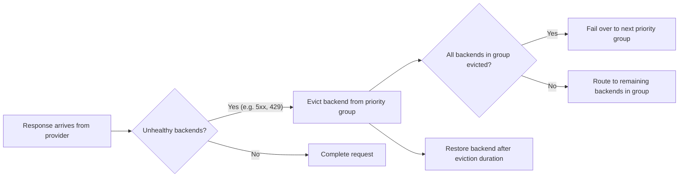

Prioritize the failover of requests across different models from an LLM provider. Include outlier detection of unhealthy LLM backends to automatically fail over when getting throttled by an unperformant model.


> [!NOTE]
> **Model-centric alternative**: You can also configure failover with the experimental `` API, by using a virtual model with `virtualModel.failover` instead of an  with priority groups. For more information, see [Virtual models]().


## About failover {#about}

Use failover (automatic fallback) to keep services running by switching to a backup when the main system fails or becomes unavailable.

For , you can set up failover across models and LLM providers. When a provider becomes unhealthy (such as returning errors or getting rate-limited), the system automatically switches to a backup provider. This configuration keeps the service running without interruptions.

Failover in  has two parts:

- **Priority groups** in the  define the failover order. Each group is a tier. Models within the same group are load balanced equally. When all models in a group are evicted, requests fail over to the next group.
- **A health policy** in an  defines what counts as an unhealthy response (such as 5xx errors or 429 rate limits) and how to evict unhealthy backends. Without a health policy, backends are not evicted and failover does not occur.


In 1.6.x and later, an  with multiple AI priority groups automatically gets default eviction when no health policy targets it. Use a health policy to classify additional responses, such as 429, or to tune eviction settings such as `duration` and `consecutiveFailures`.


This approach increases the resiliency of your network environment by ensuring that apps that call LLMs can keep working without problems, even if one model has issues.

To watch eviction and failover happen against a mock LLM rather than wait for a real provider outage, see [See failover happen](#see-failover).

### Example flow

Failover works through backend eviction, as described in the following diagram.



1. A response arrives from a provider.
2. The `unhealthyCondition` CEL expression is evaluated. If `true`, the response is marked unhealthy.
3. If eviction thresholds are met (such as `consecutiveFailures`), the backend is evicted from its priority group for the configured `duration`.
4. When all backends in a priority group are evicted, the load balancer automatically routes to the next available group.
5. Evicted backends are restored after their eviction duration expires. The eviction duration uses multiplicative backoff on repeated evictions.

**Rate-limit handling:** When a 429 response includes a `Retry-After` header, agentgateway uses that duration as the eviction time (overriding the configured `duration`). However, 429 responses only trigger eviction if your `unhealthyCondition` includes them (for example, `response.code >= 500 || response.code == 429`).

**Trigger behavior:** Both server errors (5xx) and connection-level failures, such as connection refused or DNS resolution failure, are classified as unhealthy and count toward eviction. This classification is true whether you use the built-in default or an explicit `unhealthyCondition` classification, as long as your CEL expression covers the response codes you care about.

### Failover vs. traffic splitting {#traffic-splitting}

Failover uses priority groups to automatically switch between backends when failures occur. 

For weight-based traffic distribution (A/B testing, traffic splitting, or canary deployments), see [Traffic splitting]().

For locality-aware routing (zones and regions), see [Locality-aware routing]().

## Before you begin

1. Set up an [agentgateway proxy]().
2. Set up [API access to each LLM provider]() that you want to use. The examples in this guide use OpenAI and Anthropic.

## Fail over to other models {#model-failover}

You can configure failover across multiple models and providers by using priority groups. Each priority group represents a set of providers that share the same priority level. Failover priority is determined by the order in which the priority groups are listed in the . The priority group that is listed first is assigned the highest priority.

Models within the same priority group are [load balanced]() using the Power of Two Choices (P2C) algorithm, which intelligently routes requests based on health, latency, and current load, not just simple round-robin. This pattern of P2C load balancing within a tier with failover across tiers provides superior performance compared to named strategies.

For weight-based traffic distribution within a priority group (such as 80/20 splits for A/B testing or canary rollouts), see [Traffic splitting]().

1. Create or update the  for your LLM providers.

   
   {}
   
   In this example, you configure separate priority groups for failover across multiple models from the same LLM provider, OpenAI. Each model is in its own priority group. The order of the groups determines the failover priority. If the first model is evicted, requests fail over to the second group, and so on.
   
   1. OpenAI `gpt-4.1` model (highest priority)
   2. OpenAI `gpt-5.1` model (fallback)
   3. OpenAI `gpt-3.5-turbo` model (lowest priority)

   ```yaml
   kubectl apply -f- <<EOF
   apiVersion: agentgateway.dev/v1alpha1
   kind: 
   metadata:
     name: model-failover
     namespace: 
   spec:
     ai:
       groups: 
         - providers: 
             - name: openai-gpt-41
               openai: 
                 model: gpt-4.1
               policies:
                 auth:
                   secretRef:
                     name: openai-secret
         - providers: 
             - name: openai-gpt-51
               openai: 
                 model: gpt-5.1
               policies:
                 auth:
                   secretRef:
                     name: openai-secret
         - providers: 
             - name: openai-gpt-3-5-turbo
               openai: 
                 model: gpt-3.5-turbo
               policies:
                 auth:
                   secretRef:
                     name: openai-secret
   EOF
   ```

   
   {}
   {}
   
   In this example, you configure failover across multiple providers with cost-based priority. The first priority group contains cheaper models. Responses are load-balanced across these models. In the event that both models are unavailable, requests fall back to the second priority group of more premium models.
   - Highest priority: Load balance across cheaper OpenAI `gpt-3.5-turbo` and Anthropic `claude-haiku-4-5-20251001` models.
   - Fallback: Load balance across more premium OpenAI `gpt-4.1` and Anthropic `claude-opus-4-6` models.

   Make sure that you configured both Anthropic and OpenAI providers.

   ```yaml
   kubectl apply -f- <<EOF
   apiVersion: agentgateway.dev/v1alpha1
   kind: 
   metadata:
     name: model-failover
     namespace: 
   spec:
     ai:
       groups: 
         - providers: 
             - name: openai-gpt-3.5-turbo
               openai: 
                 model: gpt-3.5-turbo
               policies:
                 auth:
                   secretRef:
                     name: openai-secret
             - name: claude-haiku
               anthropic:
                 model: claude-haiku-4-5-20251001
               policies:
                 auth:
                   secretRef:
                     name: anthropic-secret
         - providers: 
             - name: openai-gpt-4.1
               openai: 
                 model: gpt-4.1
               policies:
                 auth:
                   secretRef:
                     name: openai-secret
             - name: claude-opus
               anthropic:
                 model: claude-opus-4-6
               policies:
                 auth:
                   secretRef:
                     name: anthropic-secret
   EOF
   ```

   
   {}
   {}

   In this example, you configure failover from a self-hosted vLLM instance to a cloud provider. The self-hosted instance is a model that you run yourself, such as vLLM on your own GPU hardware. The cloud provider is a fully managed, externally hosted LLM API, such as OpenAI. Requests route to your in-cluster vLLM deployment first. If vLLM becomes unavailable, requests fail over to OpenAI.

   Before you begin, [set up vLLM]() in your cluster.

   ```yaml
   kubectl apply -f- <<EOF
   apiVersion: agentgateway.dev/v1alpha1
   kind: 
   metadata:
     name: model-failover
     namespace: 
   spec:
     ai:
       groups: 
         - providers: 
             - name: vllm-primary
               openai: 
                 model: meta-llama/Llama-3.1-8B-Instruct
               host: vllm..svc.cluster.local
               port: 8000
         - providers: 
             - name: openai-fallback
               openai: 
                 model: gpt-4.1
               policies:
                 auth:
                   secretRef:
                     name: openai-secret
   EOF
   ```

   {}
   

2. Create an HTTPRoute resource that routes incoming traffic on the `/model` path to the  that you created in the previous step. In this example, the URLRewrite filter rewrites the path from `/model` to the path of the API in the LLM provider that you want to use, such as `/v1/chat/completions` for OpenAI.

  
   
   ```yaml
   kubectl apply -f- <<EOF
   apiVersion: gateway.networking.k8s.io/v1
   kind: HTTPRoute
   metadata:
     name: model-failover
     namespace: 
   spec:
     parentRefs:
       - name: agentgateway-proxy
         namespace: 
     rules:
     - matches:
       - path:
           type: PathPrefix
           value: /model
       backendRefs:
       - name: model-failover
         namespace: 
         group: agentgateway.dev
         kind: 
   EOF
   ```
   

3. Create an  with a health policy that targets the . The health policy defines which responses are considered unhealthy and how to evict backends. Without this policy, backends are not evicted and failover does not occur.

   
   In 1.6.x and later, this policy is optional for failover on 5xx responses and connection failures. The policy in this guide adds 429 rate-limit handling and tunes how quickly a backend is evicted.
   

   The `unhealthyCondition` field is an optional [CEL expression](https://github.com/cel-expr/cel-spec) that classifies each response. When you set it, `true` means the response counts as unhealthy toward eviction. The `eviction` settings control how many failures and how long an unhealthy backend stays out of its priority group.

   
   {}

   This configuration evicts backends on both server errors (5xx) and rate-limit responses (429). This way, when you get throttled by one LLM provider, agentgateway automatically fails over to another.

   ```yaml
   kubectl apply -f- <<EOF
   apiVersion: 
   kind: 
   metadata:
     name: model-failover-health
     namespace: 
   spec:
     targetRefs:
     - group: agentgateway.dev
       kind: 
       name: model-failover
     backend:
       health:
         unhealthyCondition: "response.code >= 500 || response.code == 429"
         eviction:
           duration: 10s
           consecutiveFailures: 1
   EOF
   ```

   {}
   {}

   This configuration evicts backends only on server errors (5xx) or connection failures. Rate-limited (429) responses lower the backend's health score but do not trigger eviction.

   ```yaml
   kubectl apply -f- <<EOF
   apiVersion: 
   kind: 
   metadata:
     name: model-failover-health
     namespace: 
   spec:
     targetRefs:
     - group: agentgateway.dev
       kind: 
       name: model-failover
     backend:
       health:
         unhealthyCondition: "response.code >= 500"
         eviction:
           duration: 10s
           consecutiveFailures: 3
   EOF
   ```

   {}
   

   

   | Setting | Description |
   | --- | --- |
   | `unhealthyCondition` | Optional CEL expression that classifies each response as healthy or unhealthy. When you set this field, `true` means the response counts as unhealthy toward eviction (together with `eviction`). When you omit this field, 5xx responses and connection failures (such as connection refused or DNS resolution failure) are still classified as unhealthy by a built-in default, and count toward eviction in the same way as an explicit `unhealthyCondition` would. |
   | `eviction.duration` | Base time to remove an unhealthy backend from its priority group. Increases with multiplicative backoff on repeated evictions. When a 429 response includes `Retry-After`, that value is used instead. You might try `10s`–`60s` depending on how quickly you want failover versus avoiding flapping on brief errors. Shorter durations fail over faster. If you omit this field, the default is `3s`. |
   | `eviction.consecutiveFailures` | Number of consecutive unhealthy responses required before evicting. You might start with `3` so that a single transient error does not evict the backend. For tests, use `1` for immediate eviction. |

   
   Two more eviction settings control when a backend leaves its priority group, and the health that it returns with. Both settings are optional.

   | Setting | Description |
   | --- | --- |
   | `eviction.healthThreshold` | Exponentially weighted moving average (EWMA) health score, from `0` to `100`, below which the backend is evicted. Unlike `consecutiveFailures`, this score is a sliding-window average, so a single success delays eviction instead of resetting a counter. When you set both fields, either condition evicts the backend. When you omit both, a single unhealthy response evicts it. |
   | `eviction.restoreHealth` | Health score, from `0` to `100`, that the backend is given when its eviction expires. For gradual recovery, set a low value. To restore the backend at full health, set `100`. If you omit this field, the backend resumes with the health score that it had when it was evicted. The score weights load balancing within a priority group, so the score makes no difference when each group holds a single provider. |
   

4. Send a request to confirm that the configuration works and that your highest-priority model answers.

   
   {}
   ```bash
   curl -s "$INGRESS_GW_ADDRESS/model" -H content-type:application/json -d '{
     "messages": [{"role": "user", "content": "Say hello in one word."}]
   }' | jq '.model'
   ```
   {}
   {}
   ```bash
   curl -s "localhost:8080/model" -H content-type:application/json -d '{
     "messages": [{"role": "user", "content": "Say hello in one word."}]
   }' | jq '.model'
   ```
   {}
   

   The `model` field names the model that served the request. With the OpenAI model priority example, the first priority group answers.

   ```text
   "gpt-4.1-2025-04-14"
   ```

This request confirms your priority order. It does not exercise failover, because a healthy provider is never evicted. To watch failover happen, continue to [See failover happen](#see-failover).

## See failover happen {#see-failover}

A real provider outage is hard to arrange on purpose, so the preceding steps cannot show failover as it happens. To see the sequence on demand, point the highest-priority group at an endpoint that always fails, and the fallback group at an endpoint that always succeeds. Eviction and failover then happen on the first request, with no live provider and no token spend.

This example uses [httpbun](), a mock LLM that accepts requests without an API key. Two httpbun endpoints matter here.

| httpbun endpoint | Response |
| --- | --- |
| `/status/500` | HTTP 500, which stands in for a model that is down |
| `/llm/chat/completions` | A valid OpenAI chat completion, HTTP 200 |

One httpbun deployment serves both endpoints, so a single mock LLM acts as both the failing model and the healthy one.

1. Deploy the httpbun mock LLM.

   ```bash {paths="failover"}
   kubectl apply -f- <<EOF
   apiVersion: apps/v1
   kind: Deployment
   metadata:
     name: httpbun
     namespace: default
     labels:
       app: httpbun
   spec:
     replicas: 1
     selector:
       matchLabels:
         app: httpbun
     template:
       metadata:
         labels:
           app: httpbun
       spec:
         containers:
           - name: httpbun
             image: sharat87/httpbun
             env:
               - name: HTTPBUN_BIND
                 value: "0.0.0.0:3090"
             ports:
               - containerPort: 3090
   ---
   apiVersion: v1
   kind: Service
   metadata:
     name: httpbun
     namespace: default
     labels:
       app: httpbun
   spec:
     selector:
       app: httpbun
     ports:
       - protocol: TCP
         port: 3090
         targetPort: 3090
     type: ClusterIP
   EOF
   ```

   
   kubectl rollout status deployment/httpbun -n default --timeout=180s
   

2. Create an  with a failing primary group and a healthy fallback group. Each group names a different model, so the response tells you which group served the request.

   ```yaml {paths="failover"}
   kubectl apply -f- <<EOF
   apiVersion: 
   kind: 
   metadata:
     name: failover-demo
     namespace: 
   spec:
     ai:
       groups:
         - providers:
             - name: failing-primary
               openai:
                 model: gpt-4
               host: httpbun.default.svc.cluster.local
               port: 3090
               path: "/status/500"
         - providers:
             - name: healthy-fallback
               openai:
                 model: gpt-4o-mini
               host: httpbun.default.svc.cluster.local
               port: 3090
               path: "/llm/chat/completions"
   EOF
   ```

   
   YAMLTest -f - <<'EOF'
   - name: wait for failover-demo backend to be accepted
     wait:
       target:
         kind: AgentgatewayBackend
         metadata:
           namespace: agentgateway-system
           name: failover-demo
       jsonPath: "$.status.conditions[?(@.type=='Accepted')].status"
       jsonPathExpectation:
         comparator: equals
         value: "True"
       polling:
         timeoutSeconds: 60
         intervalSeconds: 2
   EOF
   

3. Create an HTTPRoute that sends the `/failover-demo` path to the . Each provider sets its own upstream path, so this route needs no URLRewrite filter.

   ```yaml {paths="failover"}
   kubectl apply -f- <<EOF
   apiVersion: gateway.networking.k8s.io/v1
   kind: HTTPRoute
   metadata:
     name: failover-demo
     namespace: 
   spec:
     parentRefs:
       - name: agentgateway-proxy
         namespace: 
     rules:
     - matches:
       - path:
           type: PathPrefix
           value: /failover-demo
       backendRefs:
       - name: failover-demo
         namespace: 
         group: 
         kind: 
   EOF
   ```

   
   YAMLTest -f - <<'EOF'
   - name: wait for failover-demo HTTPRoute to be accepted
     wait:
       target:
         kind: HTTPRoute
         metadata:
           namespace: agentgateway-system
           name: failover-demo
       jsonPath: "$.status.parents[0].conditions[?(@.type=='Accepted')].status"
       jsonPathExpectation:
         comparator: equals
         value: "True"
       polling:
         timeoutSeconds: 60
         intervalSeconds: 2
   - name: wait for failover-demo HTTPRoute refs to be resolved
     wait:
       target:
         kind: HTTPRoute
         metadata:
           namespace: agentgateway-system
           name: failover-demo
       jsonPath: "$.status.parents[0].conditions[?(@.type=='ResolvedRefs')].status"
       jsonPathExpectation:
         comparator: equals
         value: "True"
       polling:
         timeoutSeconds: 60
         intervalSeconds: 2
   EOF
   

4. Create an  with a health policy that evicts a backend on the first server error. To keep the sequence short, this example sets `consecutiveFailures` to `1` and a `duration` of `10s`.

   ```yaml {paths="failover"}
   kubectl apply -f- <<EOF
   apiVersion: 
   kind: 
   metadata:
     name: failover-demo-health
     namespace: 
   spec:
     targetRefs:
     - group: 
       kind: 
       name: failover-demo
     backend:
       health:
         unhealthyCondition: "response.code >= 500"
         eviction:
           duration: 10s
           consecutiveFailures: 1
   EOF
   ```

   
   YAMLTest -f - <<'EOF'
   - name: wait for failover-demo-health policy to be accepted
     wait:
       target:
         kind: AgentgatewayPolicy
         metadata:
           namespace: agentgateway-system
           name: failover-demo-health
       jsonPath: "$.status.ancestors[0].conditions[?(@.type=='Accepted')].status"
       jsonPathExpectation:
         comparator: equals
         value: "True"
       polling:
         timeoutSeconds: 120
         intervalSeconds: 2
   EOF
   

5. Save the gateway address in an environment variable.

   
   {}
   ```bash
   export INGRESS_GW_ADDRESS=$(kubectl get svc -n  agentgateway-proxy -o=jsonpath="{.status.loadBalancer.ingress[0]['hostname','ip']}")
   echo $INGRESS_GW_ADDRESS
   ```
   {}
   {}
   ```bash
   kubectl port-forward deployment/agentgateway-proxy -n  8080:80 &
   export INGRESS_GW_ADDRESS=localhost:8080
   ```
   {}
   

   
   # Resolve the gateway address the same way the LoadBalancer tab does.
   export INGRESS_GW_ADDRESS=$(kubectl get svc -n agentgateway-system agentgateway-proxy -o=jsonpath="{.status.loadBalancer.ingress[0]['hostname','ip']}")

   # The first request must reach the failing primary group and return a 500.
   # This is the eviction trigger, so it has to happen before the assertion below.
   FIRST_CODE=$(curl -s -o /dev/null -w '%{http_code}' "http://${INGRESS_GW_ADDRESS}/failover-demo" \
     -H 'content-type: application/json' \
     -d '{"messages": [{"role": "user", "content": "Say hello."}]}')
   if [ "$FIRST_CODE" != "500" ]; then
     echo "expected HTTP 500 from the primary group on the first request, got ${FIRST_CODE}"
     exit 1
   fi
   

   
   # After the primary group is evicted, requests must fail over to healthy-fallback,
   # which is the only provider configured with the gpt-4o-mini model.
   YAMLTest -f - <<'EOF'
   - name: verify failover reaches the fallback group
     http:
       url: "http://${INGRESS_GW_ADDRESS}/failover-demo"
       method: POST
       headers:
         Content-Type: application/json
       body: |
         {
           "messages": [{"role": "user", "content": "Say hello."}]
         }
     source:
       type: local
     retries: 3
     expect:
       statusCode: 200
       bodyJsonPath:
         - path: "$.model"
           comparator: equals
           value: "gpt-4o-mini"
   EOF
   

6. Send five requests in sequence. The command prints the status code and the model that answered each request.

   ```bash
   for i in 1 2 3 4 5; do
     RESPONSE=$(curl -s -w '\n%{http_code}' "$INGRESS_GW_ADDRESS/failover-demo" \
       -H content-type:application/json \
       -d '{"messages": [{"role": "user", "content": "Say hello."}]}')
     echo "request $i: HTTP $(echo "$RESPONSE" | tail -n1), model $(echo "$RESPONSE" | sed '$d' | jq -r '.model // "none"')"
   done
   ```

   The first request fails, and every request after it succeeds on the fallback model.

   ```text
   request 1: HTTP 500, model none
   request 2: HTTP 200, model gpt-4o-mini
   request 3: HTTP 200, model gpt-4o-mini
   request 4: HTTP 200, model gpt-4o-mini
   request 5: HTTP 200, model gpt-4o-mini
   ```

   Each part of the failover path appears in this output.

   * Request 1 reaches `failing-primary` in the highest-priority group and receives a 500 from httpbun. The `unhealthyCondition` expression classifies that response as unhealthy, and `consecutiveFailures: 1` evicts the backend immediately. The client still receives the 500, because the response is returned before the eviction takes effect.
   * `failing-primary` is the only provider in its group, so evicting that provider empties the group and requests fail over to the next group.
   * Requests 2 through 5 return `gpt-4o-mini`, which is the model that `healthy-fallback` is configured with. The model name confirms that the fallback group served these requests.

7. Send requests for about a minute to watch the evicted backend rejoin its group and leave again.

   ```bash
   for i in $(seq 16); do
     curl -s -o /dev/null -w "%{http_code} " "$INGRESS_GW_ADDRESS/failover-demo" \
       -H content-type:application/json \
       -d '{"messages": [{"role": "user", "content": "Say hello."}]}'
     sleep 3
   done
   ```

   A 500 reappears each time an eviction expires, and the gap between the failures grows.

   ```text
   200 200 200 200 500 200 200 200 200 200 200 500 200 200 200 200
   ```

   When an eviction expires, `failing-primary` rejoins its priority group. Because that group has the highest priority, the next request goes back to it, fails again, and evicts it again. Eviction duration uses multiplicative backoff, so each eviction lasts longer than the one before it. A model that stays broken therefore costs one failed request per eviction window, and the windows grow further apart. The run starts with successes because the eviction from the previous step is still in effect.

### Fail over without returning an error {#hide-failure}

In the preceding sequence the client receives the 500 from request 1. To fail over without passing that error back to the client, add a [retry policy]() alongside the health policy.

```yaml {paths="failover"}
kubectl apply -f- <<EOF
apiVersion: 
kind: 
metadata:
  name: failover-demo-retry
  namespace: 
spec:
  targetRefs:
  - group: gateway.networking.k8s.io
    kind: HTTPRoute
    name: failover-demo
  traffic:
    retry:
      attempts: 2
      backoff: 1s
      codes:
      - 500
EOF
```

Send the requests from the previous step again. This time the first request also succeeds.

```text
request 1: HTTP 200, model gpt-4o-mini
request 2: HTTP 200, model gpt-4o-mini
request 3: HTTP 200, model gpt-4o-mini
```


# Restart the proxy so that the primary group starts healthy again. Without this
# reset the primary is still evicted from the previous step, and a 200 would prove
# nothing about the retry policy.
kubectl rollout restart deployment/agentgateway-proxy -n agentgateway-system
kubectl rollout status deployment/agentgateway-proxy -n agentgateway-system --timeout=180s
sleep 10
export INGRESS_GW_ADDRESS=$(kubectl get svc -n agentgateway-system agentgateway-proxy -o=jsonpath="{.status.loadBalancer.ingress[0]['hostname','ip']}")

# With the retry policy in place, the very first request must succeed on the
# fallback group instead of returning the primary group's 500.
YAMLTest -f - <<'EOF'
- name: verify the retry policy hides the primary group failure
  http:
    url: "http://${INGRESS_GW_ADDRESS}/failover-demo"
    method: POST
    headers:
      Content-Type: application/json
    body: |
      {
        "messages": [{"role": "user", "content": "Say hello."}]
      }
  source:
    type: local
  expect:
    statusCode: 200
    bodyJsonPath:
      - path: "$.model"
        comparator: equals
        value: "gpt-4o-mini"
EOF


Retries and eviction do different jobs here, and transparent failover needs both.

* Eviction removes the failing backend from its priority group, which is what sends the next attempt to a different group.
* The retry supplies that next attempt inside the same client request, so the client never sees the 500.

> [!IMPORTANT]
> A retry policy on its own does not fail over. Without a health policy, no backend is evicted, so every retry returns to the same highest-priority group and the client still receives the error. To fail over transparently, configure both policies.


In 1.6.x and later, multiple AI priority groups enable default eviction without a health policy. You still need a health policy when the retry policy must fail over on responses that the default classifier does not mark unhealthy, such as 429.


## Cleanup



Remove the failover configuration.

```shell
kubectl delete  model-failover -n 
kubectl delete  model-failover-health -n 
kubectl delete httproute model-failover -n 
```

If you followed [See failover happen](#see-failover), remove the mock LLM resources too.

```shell
kubectl delete  failover-demo-health -n  --ignore-not-found
kubectl delete  failover-demo-retry -n  --ignore-not-found
kubectl delete httproute failover-demo -n  --ignore-not-found
kubectl delete  failover-demo -n  --ignore-not-found
kubectl delete deployment httpbun -n default --ignore-not-found
kubectl delete service httpbun -n default --ignore-not-found
```


# Remove only what this scenario created. The httpbun deployment is left in place,
# because the setup-httpbun-llm prerequisite created it and other scenarios use it.
kubectl delete AgentgatewayPolicy failover-demo-health -n agentgateway-system --ignore-not-found
kubectl delete AgentgatewayPolicy failover-demo-retry -n agentgateway-system --ignore-not-found
kubectl delete httproute failover-demo -n agentgateway-system --ignore-not-found
kubectl delete AgentgatewayBackend failover-demo -n agentgateway-system --ignore-not-found


## Next

Explore other agentgateway features.

* Learn more about [load balancing strategies]() and the P2C algorithm.
* Pass in [functions]() to an LLM to request as a step towards agentic AI.
* Set up [prompt guards]() to block unwanted requests and mask sensitive data.
* [Enrich your prompts]() with system prompts to improve LLM outputs.
