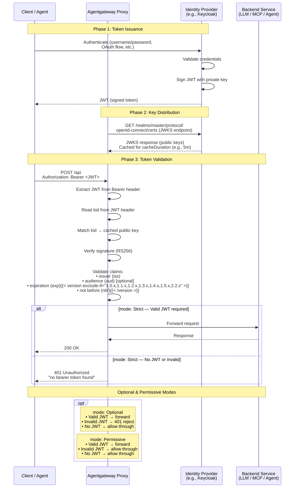

A JSON Web Token (JWT) is an open standard for securely sharing information between a client and your apps. JWTs are commonly used to support stateless, simple, scalable, and interoperable authentication and authorization flows.

### Common use cases {#use-cases}

[JSON Web Tokens (JWT)](https://auth0.com/docs/secure/tokens/json-web-tokens) are commonly used to offload authentication and authorization code from your apps. 

* **Authentication**: Instead of storing user session information server-side which can lead to scalability issues, you set up a JWT issuer, such as an OpenID Connect (OIDC) or Single Sign-on (SSO) provider. After a user authenticates, the provider returns a JWT in the response that is stored client-side. Subsequent requests from the client include the JWT, which is faster to verify than performing the entire authentication and authorization process again.
* **Authorization**: JWTs can have custom claims that can define a user's scope, role, or other permissions. You can use these claims in combination with other policies to enforce fine-grained access control to your apps. By including the claim information within the JWT, the authorization process can happen faster and more scalably.
* **Secure information exchange**: Because the token is in JSON format, many otherwise incompatible systems and services can use the token to exchange information. The authentication and authorization features built into the token help these systems validate and trust the information. 

> [!WARNING]
> Keep in mind that JWT data is encoded but not encrypted. As such, consider using JWT policies with no personally identifiable information (PII) or sensitive data, and only on HTTPS traffic.

### JWT structure {#structure}

A JWT has three parts: header, payload, and signature. These three parts are base64 encoded, combined, and separated by the dot character (`.`) to form the final token. To review and decode JWTs, you can use a tool such as [the jwt.io debugger](https://www.jwt.io/).
JWT parts are structured as follows:
* A header with metadata, such as the signing algorithm.
* A payload of user information or "claims" that provide identity information, such as the following common claims:
  * The seven reserved claims per the [RFC 7519 spec](https://datatracker.ietf.org/doc/html/rfc7519#section-4.1). The most common are:
    * `iss`: The entity that issued the token.
    * `sub`: The subject of the token, usually a user ID.
    * `aud`: The audience the token is issued for, important for security purposes so that the token is not used for other purposes.
  * Additional registered claims per the OpenID Connect Core to encourage interoperability, such as `email`, `scope`, or `client_id`. For more information, see [IANA JSON Web Token Claims](https://www.iana.org/assignments/jwt/jwt.xhtml#claims).
  * Additional custom claims that you or your OIDC provider create. For an example, see the [Auth0 docs](https://auth0.com/docs/get-started/apis/scopes/sample-use-cases-scopes-and-claims).
  * Nested claims are supported in the key name when you also include a `nestedClaimDelimiter`, such as a period (`.`). Then, JWTs that match the value you set for the child nested claim are allowed. For an example, see [Nested claims](https://docs.solo.io/gloo-mesh-gateway/main/security/jwt/jwt-authz/#nested-claims).
* A signature that signs the header and payload 

### How JWT verification works

JWT authentication uses asymmetric cryptography with public and private key pairs to sign and verify JWTs. Review the following phases during the JWT validation: 

1. **Token issuance**: The identity provider, such as Keycloak signs JWTs with its private key.
2. **Key distribution**: The identity provider publishes its public keys through a JWKS (JSON Web Key Set) endpoint. Each key has a unique key ID (`kid`).
3. **Token validation**: Agentgateway reads the `kid` from the JWT header and fetches the matching public key from the configured JWKS endpoint. The JWKS endpoint can be added as an inline JWKS or a remote JWKS address in the . After the agentgateway proxy fetched the public key, it uses the public key to verify the JWT signature. If the JWT includes an `nbf` claim, the agentgateway proxy also rejects the token when the `nbf` value is more than 60 seconds in the future.

When multiple JWT providers are configured, the agentgateway proxy selects the provider by the token's `iss` claim and `kid` header. Then, the proxy verifies the signature and claims. This selection is important for multi-tenant identity providers, because a `kid` is unique only within one issuer's JWKS.

Review the following diagram to understand the JWT request flow: 

### Remote vs. inline JWKS

Using a remote JWKS endpoint is the recommended approach when using JWT authentication in product. Review the benefits that remote JWKS endpoints provide over inline JWKS: 
- **Automatic key rotation**: When the identity provider rotates keys, the agentgateway proxy automatically fetches the new keys
- **No manual key management**: You don't need to update policies when keys change
- **Multiple keys**: The JWKS endpoint can return multiple keys, supporting gradual key rotation

## What's next

After setting up JWT authentication, you can use the verified JWT claims in authorization policies to control which requests are allowed to reach your backends.

For more information, see [Authorization]().

