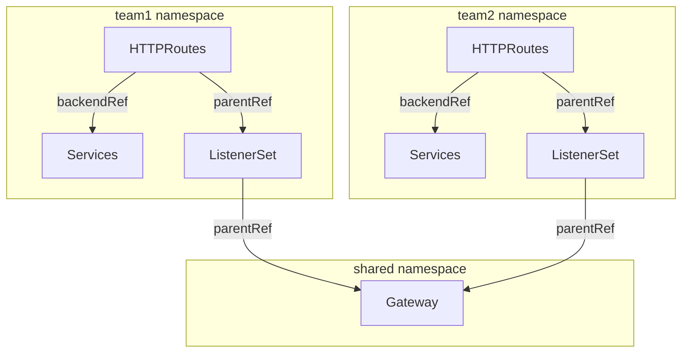

Set up listeners on your agentgateway proxy. A listener configures how your proxy accepts and processes incoming requests.

In the Kubernetes Gateway API, you can create listeners in two main ways:

* Inline as part of the Gateway resource.
* As a separate resource called a ListenerSet.

## Inline on the Gateway {#inline}

A common, simple approach is to write the listener inline on the Gateway resource. You have the flexibility to write different protocols, ports, and even TLS certificates. Each listener can specify its own hostname, or inherit the hostname of the Gateway. Gateways support up to 64 listeners.

Most examples in both the  and Kubernetes Gateway API docs use the inline approach.

## ListenerSets {#listenersets}

With ListenerSets, you can group together listeners that have their own unique configuration, such as different protocols, ports, hostnames, or TLS settings. Then, the ListenerSet refers to a Gateway, which can be in a different namespace than the ListenerSet. The same Gateway can also have multiple ListenerSets.


Integrations that call `WithExtraListenerSets` can contribute listener sets without creating Gateway API ListenerSet resources. The syncer admits these `translator.ListenerSet` contributions only when the parent Gateway's `allowedListeners` policy accepts the contribution namespace and the contribution carries a valid listener identity. After admission, these contributions use the same bind, route-parent, and listener precedence rules as CRD-derived ListenerSets. Rejected contributions are not written to Gateway API status. The integration reports them from `Outputs.RejectedListenerSets`.


Similar to Gateways, ListenerSets can have a maximum of 64 listeners. However, because you can attach multiple ListenerSets to a single Gateway, now a single Gateway can have more than 64 listeners. Keep in mind that more listeners can impact how long it takes to propagate configuration changes on the Gateway. If you have more than 1,000 listeners, consider attaching ListenerSets to multiple Gateways.

### ListenerSet use cases {#listenerset-use-cases}

As such, you might use ListenerSets for the following advantages:

- **Multitenancy**: You can let different teams create their own ListenerSets, but share the same Gateway and backing load balancing infrastructure.
- **Inheritance**: Because ListenerSets inherit routes and policies from the Gateway, you can standardize the configuration of listeners across a multitenant environment. Teams still have the flexibility to overwrite settings in the ListenerSet.
- **Large scale deployments**: By using ListenerSets, Gateways can have more than 64 listeners attached. Teams can also share the same ListenerSet configuration to avoid duplication.
- **Certificates for more listeners per gateway**: Because you can now have more than 64 listeners per Gateway, a single Gateway can forward secured traffic to more backends that might have their own certificates. This approach aligns with projects that might require service-level certificates, such as Istio Ambient Mesh or Knative.

The following diagram presents a simple illustration of how ListenerSets can help you decentralize route configuration in a multitenant environment at scale.

* Team 1 and Team 2 each manage their own Service and HTTPRoute resources within their respective namespaces.
* Each HTTPRoute refers to a namespace-local ListenerSet. This way, each team controls how their routes are exposed, such as the protocol, port, and TLS certificate settings.
* The ListenerSets from both teams share a common Gateway in a separate namespace. A separate Gateway team can setup and manage centralized infrastructure or enforce policies as appropriate.


### Listener precedence {#listener-precedence}

Listeners that share a port must use the same protocol and the same bind mode. Each listener must also claim a hostname that no earlier listener on that port already claimed.

Several listeners can share a port, which is how one port serves more than one hostname. Each listener is checked against the listeners that are already accepted on its port, so precedence decides which listener keeps a contested setting.

The losing listener reports `Conflicted: True` and `Accepted: False` in its status, with a reason of `HostnameConflict`, `ProtocolConflict`, or `BindModeConflict`. Precedence follows the order that [GEP-1713](https://gateway-api.sigs.k8s.io/geps/gep-1713/#listener-precedence) defines:

1. Listeners written inline on the Gateway come before any listener that a ListenerSet contributes.
2. ListenerSets are ordered by `metadata.creationTimestamp`, oldest first.
3. ListenerSets that share a creation timestamp are ordered alphabetically, first by namespace and then by name.
4. Within a single ListenerSet, listeners keep the order that they appear in `spec.listeners`.

Precedence starts from the creation timestamp, so deleting and re-creating a ListenerSet gives that ListenerSet a later timestamp and sorts it behind every other ListenerSet on the same Gateway. Listeners that previously won a contested port then report a conflict instead.


### More information {#more-info}

The listener setup guides in this section include tabs for examples of using both the inline and ListenerSet approaches.

For more information about ListenerSets, see the [Kubernetes Gateway API docs](https://gateway-api.sigs.k8s.io/geps/gep-1713/).

