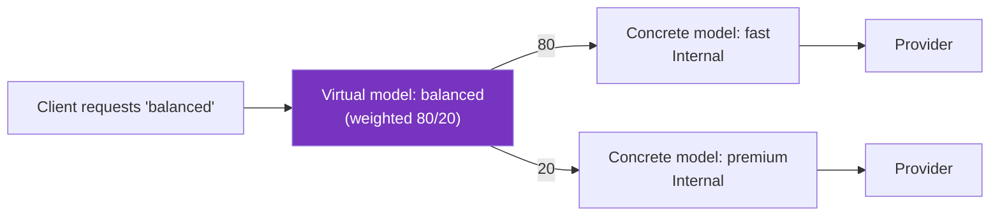

Learn how the `` API provides a model-centric way to serve LLMs in Kubernetes.

> [!WARNING]
> The `` API is experimental and disabled by default. The `v1alpha1` API is subject to change in a future release. To enable it, set the `agentgatewayModels.enabled=true` Helm value on the  control plane.

## About

Clients talk to an LLM gateway in terms of models. They send a request with `"model": "gpt-5-mini"` in the body and expect the gateway to figure out the rest.

Historically in Kubernetes, you assembled that experience yourself from a listener, an `HTTPRoute` that matched on the request body, an  for each provider, and an  for the AI behavior. Every LLM deployment needed the same scaffolding, and that scaffolding stayed visible in your configuration.

The `` API removes the scaffolding. Each resource declares one client-facing model and attaches to a parent, such as a Gateway listener. Agentgateway derives the routing, so you configure only what is specific to your setup.

Every model that attaches to the same parent is aggregated into a single model table, called a *model router*. From that table, agentgateway serves the following behavior.

- Model extraction from the request body.
- The standard LLM API paths, such as `/v1/chat/completions`.
- Model discovery on `/v1/models`.
- Per-model provider routing.
- OpenAI-compatible error responses for unknown models.

The parent that you choose decides which model router a model joins, and where that router is served. For more information, see [Parent types](#parent-types).

### Model-centric vs. route-centric configuration

Both approaches are supported. Use this table to choose.

| Question | Answer | Recommendation |
|----------|--------|----------------|
| Are you exposing LLM models to clients through the standard OpenAI-compatible paths? | Yes | `` |
| Do you want `/v1/models` discovery without configuring it? | Yes | `` |
| Do you want to serve LLM paths under a path prefix, such as `/tenant-a/v1/chat/completions`? | Yes | `` on an [`HTTPRoute` parent](#path-scoped-models-on-an-httproute) |
| Do you need to route on methods, query parameters, or headers? | Yes |  and `HTTPRoute` |
| Do you need to attach an  to an individual model? | Yes |  and `HTTPRoute` |
| Do you need to route to non-LLM backends on the same listener? | Either | Both can share one listener |

> [!NOTE]
> An  cannot target an ``. Policies that you attach to the Gateway apply to every model on that listener. To scope a policy to a smaller set of models, you have three options: the inline `spec.policies` field on the `` for one model, an  that targets an [`HTTPRoute` rule](#path-scoped-models-on-an-httproute) for a group of models, or the  and `HTTPRoute` approach. For the policies that the inline field supports, see [Model policies](#model-policies).

## Parent types

Each `` lists one or more parents in `spec.parentRefs`. The parent kind decides which model router the model joins, and which paths serve that router.

| Parent kind | Model router | Paths |
|-------------|--------------|-------|
| `Gateway` | The listener's default router, shared by every model that attaches to the same listener. | The standard LLM paths at the listener root, such as `/v1/chat/completions` and `/v1/models`. |
| `ListenerSet` | The same as a `Gateway` parent, for a listener that a `ListenerSet` contributes. | The standard LLM paths at the listener root. |
| `HTTPRoute` | A separate router for the referenced route rule, with its own model table. | The standard LLM paths under the rule's path prefix, such as `/tenant-a/v1/chat/completions`. |

A `Gateway` parent is the default choice. Use an `HTTPRoute` parent when one listener needs more than one independent set of models, or when a group of models needs its own policies. For more information, see [Path-scoped models on an HTTPRoute](#path-scoped-models-on-an-httproute).

Models on different routers are isolated from each other. A request to one router's paths can select only the models on that router, and `/v1/models` on that router lists only those models.

## Listener opt-in

A listener serves LLM traffic only when it explicitly allows the route kinds that its models attach through, in `allowedRoutes.kinds`. Allow the `` kind for models that attach directly to the listener, and the `HTTPRoute` kind for models that attach through a route.

The following example allows models to attach directly to the listener.

```yaml
apiVersion: gateway.networking.k8s.io/v1
kind: Gateway
metadata:
  name: agentgateway-proxy
  namespace: 
spec:
  gatewayClassName: 
  listeners:
  - name: http
    port: 80
    protocol: HTTP
    allowedRoutes:
      namespaces:
        from: All
      # Enables the listener's built-in LLM paths
      kinds:
      - group: agentgateway.dev
        kind: 
```

Adding the route kind turns on the listener's built-in LLM paths. At first the listener has zero models, so every request returns a `model_not_found` error. Models become available as they attach.

A listener can allow both `` and `HTTPRoute`, so LLM endpoints and ordinary HTTP routes coexist on the same port. When you set `allowedRoutes.kinds`, the listener accepts only the kinds that you list, so include every kind that you need. Models that attach through an `HTTPRoute` parent need only the `HTTPRoute` kind, because the route is what attaches to the listener.

```yaml
apiVersion: gateway.networking.k8s.io/v1
kind: Gateway
metadata:
  name: agentgateway-proxy
  namespace: 
spec:
  gatewayClassName: 
  listeners:
  - name: http
    port: 80
    protocol: HTTP
    allowedRoutes:
      namespaces:
        from: All
      kinds:
      - group: agentgateway.dev
        kind: 
      - group: gateway.networking.k8s.io
        kind: HTTPRoute
```

## Path-scoped models on an HTTPRoute

A `Gateway` parent gives a listener one model router at the listener root. That setup is enough for a single set of models, but not when one listener must serve several independent sets. To create additional routers on the same listener, declare each one with an `HTTPRoute` and attach models to the route instead of the Gateway.

Use an `HTTPRoute` parent for the following cases.

- Serve the LLM paths under a path prefix, such as `/tenant-a/v1/chat/completions`.
- Give one listener several model tables, so that `/v1/models` returns a different list per path.
- Apply an  to a group of models rather than to one model or to the whole listener.

### Route requirements

An `HTTPRoute` is a valid parent for an `` only when it meets the following requirements. A route that does not opt in with an `` backend stays an ordinary route, and a route that opts in but breaks one of the other requirements is rejected.

| Requirement | Detail |
|-------------|--------|
| Parent kind is `HTTPRoute` | Set `kind: HTTPRoute` and `group: gateway.networking.k8s.io` in the model's `spec.parentRefs` entry. |
| The route is in the model's namespace | Cross-namespace references from a model to a route are not supported. |
| One rule is selected | Set `sectionName` on the model's `parentRefs` entry to the `name` of the route rule. You can omit `sectionName` only when the route has exactly one rule. |
| The rule has exactly one `backendRef` | The `backendRef` must set `group: agentgateway.dev`, `kind: `, and `name: "*"`. This backend is what opts the rule in as a model router. A rule cannot mix it with other backends. |
| The `backendRef` sets no port, weight other than 1, or filters | Omit `port`. Omit `weight`, or set it to `1`. Omit `filters`. If you set `namespace`, it must be the route's own namespace. |
| Path matches use `PathPrefix` | An `Exact` or `RegularExpression` path match is rejected, because the router serves a set of paths under the prefix. A rule can have several matches as long as every path match uses `PathPrefix`. |
| No `URLRewrite` or `RequestRedirect` filter on the rule | Agentgateway rewrites the prefix itself so that the provider receives the standard LLM path. Other rule-level filters, such as `RequestHeaderModifier`, and rule-level `timeouts` and `retry` are supported. |

Requirements are checked per model. When a model's parent reference fails one of them, the model reports `Accepted: False` with the reason in the condition message. To check, run `kubectl get agentgatewaymodel <name> -n <namespace> -o yaml` and read `status.parents`.

### Example

The following `HTTPRoute` declares a model router under `/tenant-a`, and the model attaches to that route's `models` rule. The  targets the same rule, so it applies to every model on that router and to nothing else on the listener.

The listener that the route attaches to must allow the `HTTPRoute` kind, as shown in [Listener opt-in](#listener-opt-in).

```yaml
apiVersion: gateway.networking.k8s.io/v1
kind: HTTPRoute
metadata:
  name: tenant-a-models
  namespace: 
spec:
  parentRefs:
  - name: agentgateway-proxy
    sectionName: http
  rules:
  # Name the rule so that models and policies can select it
  - name: models
    matches:
    - path:
        type: PathPrefix
        value: /tenant-a
    # The wildcard model backend is what turns this rule into a model router
    backendRefs:
    - group: agentgateway.dev
      kind: 
      name: "*"
---
apiVersion: agentgateway.dev/v1alpha1
kind: 
metadata:
  name: gpt-5-mini
  namespace: 
spec:
  parentRefs:
  - group: gateway.networking.k8s.io
    kind: HTTPRoute
    name: tenant-a-models
    sectionName: models
  provider: OpenAI
  policies:
    auth:
      secretRef:
        name: openai-secret
---
apiVersion: agentgateway.dev/v1alpha1
kind: 
metadata:
  name: tenant-a-auth
  namespace: 
spec:
  targetRefs:
  - group: gateway.networking.k8s.io
    kind: HTTPRoute
    name: tenant-a-models
    sectionName: models
  traffic:
    basicAuthentication:
      secretRef:
        name: tenant-a-users
```

With this configuration, clients reach the router under the route's prefix.

- `GET /tenant-a/v1/models` lists `gpt-5-mini` and no other models.
- `POST /tenant-a/v1/chat/completions` with `"model": "gpt-5-mini"` serves the request.
- Both paths require the basic authentication credentials that the policy sets.

Agentgateway strips the `/tenant-a` prefix before it forwards the request, so the provider receives the standard `/v1/chat/completions` path.

### Router scoping constraints

- **A virtual model and the concrete models it selects must share one router.** A `weighted` or `conditional` virtual model resolves its targets by model name inside its own router's table. Attach the virtual model and its targets to the same parent; otherwise, the request fails with `virtual_model_not_resolved`.
- **A root-path model route cannot share a listener with directly attached models.** If a model-serving rule matches `/`, has no matches at all, or has a match with no path, then no `` can attach directly to the same listener through a `Gateway` parent. Both would claim the same paths, so the model on the route is rejected with a conflict message. Give the route a distinct prefix, or move the directly attached models onto routes.
- **The rule name is part of the router identity.** Renaming a route rule moves its models to a new router. If you omit the rule name, the rule's index in the list identifies the router instead, so reordering rules has the same effect.

## Concrete and virtual models

Every model is an `` resource. A model either names a particular language model the provider that serves it ("concrete" model), or routes across other models ("virtual" model). The two fields are mutually exclusive.

| Kind | Sets | Role |
|------|------|------|
| [Concrete model](#concrete-models) | `spec.provider` | A particular model from an LLM provider that serves as the destination. The provider that is named in the spec serves the request. |
| [Virtual model](#virtual-models) | `spec.virtualModel` | A client-facing name that resolves to a concrete model at request time. It has no provider of its own. |

The following diagram shows a client requesting the `balanced` virtual model, which splits traffic 80/20 across two internal concrete models. Each concrete model forwards to its provider.



> [!NOTE]
> Publishing a friendly name is not what makes a model virtual. A concrete model can publish any client-facing name and rewrite it for the provider with a `model` transformation, which is [aliasing](#model-aliasing). That model is still concrete, because a single provider serves it. A model is virtual only when it routes across several other models.

## Concrete models

A model that names its provider is a concrete model. It is an `` that sets `spec.provider`, so the gateway knows which provider serves the request.

The following example shows the pieces that a concrete model configures. Only `parentRefs` and `provider` are required.

```yaml
apiVersion: agentgateway.dev/v1alpha1
kind: 
metadata:
  name: gpt-5-mini
  namespace: 
spec:
  # The parent that serves this model, here a Gateway listener
  parentRefs:
  - group: gateway.networking.k8s.io
    kind: Gateway
    name: agentgateway-proxy
    sectionName: http
  # The model name that clients request; defaults to metadata.name
  match:
    model: gpt-5-mini
  # Whether clients can request this model directly
  visibility: Public
  # The provider that serves this model
  provider: OpenAI
  # Optional: override the provider address and base path
  baseURL: https://api.openai.com/v1
  # Optional: policies that apply to this model only
  policies:
    auth:
      secretRef:
        name: openai-secret
```

{}

| Field | Description |
|-------|-------------|
| [`parentRefs`](#parent-types) | The parents that serve this model. A `Gateway` or `ListenerSet` parent attaches the model to that parent's listeners, and `sectionName` selects one listener. An `HTTPRoute` parent attaches the model to one rule on that route, and `sectionName` selects the rule. |
| [`match.model`](#model-matching) | The model name that selects this resource in a client request. Defaults to `metadata.name`. |
| [`visibility`](#visibility) | Whether clients can request the model directly. Defaults to `Public`. |
| [`provider`](#providers) | The provider that serves the model, such as `OpenAI`. |
| [`baseURL`](#providers) | Overrides the provider address and base path prefix. The path in the URL is the base path that provider endpoint paths are appended to, so include the path that the provider serves its API under. |
| [`policies`](#model-policies) | Credentials, authorization, transformations, and other settings that apply to this model only. |

### Model matching

Use `spec.match.model` to control which model name in a request selects this resource. When you omit `spec.match`, the model matches `metadata.name` exactly.

For example, a model named `gpt-5-mini` with no `spec.match` serves requests that send `"model": "gpt-5-mini"` in the body. To publish a different name, set `spec.match.model` explicitly.

A match must use one of the following forms. Wildcards in any other position are rejected.

| Form | Example | Matches |
|------|---------|---------|
| Exact | `gpt-5-mini` | Only `gpt-5-mini`. |
| Suffix wildcard | `openai/*` | Any model name that starts with `openai/`. |
| Prefix wildcard | `*-latest` | Any model name that ends with `-latest`. |
| Catch-all | `*` | Any model name. |

A wildcard model usually pairs with a `model` transformation, because the provider expects its own model name rather than the client-facing one. For an example, see [Serve a model]().

### Model aliasing

A model resource is an alias by construction. The name that clients request is `metadata.name` or `match.model`, and the name that the provider receives comes from a `model` transformation. To publish `fast` as an alias for `gpt-3.5-turbo`, create a model named `fast` that rewrites the field.

```yaml
apiVersion: agentgateway.dev/v1alpha1
kind: 
metadata:
  name: fast
  namespace: 
spec:
  parentRefs:
  - group: gateway.networking.k8s.io
    kind: Gateway
    name: agentgateway-proxy
    sectionName: http
  provider: OpenAI
  policies:
    transformations:
    - field: model
      expression: '"gpt-3.5-turbo"'
```

Each alias is a separate resource, so it can carry its own credentials, authorization rules, and guardrails. For the  equivalent, see [Model aliasing]().

### Model resolution order {#agentgatewaymodel-resolution}

The model value is resolved before provider-specific routing, request conversion, token-count behavior, and response conversion. First, the request model selects an  from `spec.match.model`. A virtual model can then select a concrete target model, and `spec.policies.transformations` on the concrete model can rewrite the `model` field. The final resolved model is used for provider-specific behavior, such as Azure Foundry Claude routing, Bedrock endpoint selection, and Vertex Gemini path selection.

A request must have a model after resolution. If the client request omits `model`, configure the selected concrete model to supply one with a `model` transformation.

### Visibility

Use `spec.visibility` to control whether clients can request a model directly.

| Value | Behavior |
|-------|----------|
| `Public` (default) | Clients can request the model directly, and it appears in `/v1/models`. |
| `Internal` | Only virtual models can select the model. Direct requests return `model_not_found`, and the model is excluded from `/v1/models`. |

Set `Internal` on concrete models that exist only as virtual model targets.

### Model policies

Concrete models accept an inline `spec.policies` block that supports the following policies. Each policy applies only to the model that declares it.

| Policy | Purpose |
|--------|---------|
| `auth` | Credentials for authenticating to the provider. |
| `authorization` | Rules that clients must satisfy to use the model. |
| `transformations` | CEL transformations on fields in the provider request body. |
| `promptGuard` | Guardrails on requests and responses. |
| `health` | What counts as an unhealthy response, and when to evict. |
| `tls` | TLS settings for connections to the provider. |
| `tunnel` | Proxy tunnel used to reach the provider. |
| `headers` | Request and response header changes. |

Virtual models cannot set `spec.policies`, because a virtual model has no provider of its own to authenticate to, transform for, or health check. Configure these policies on the concrete models that the virtual model targets.

### Providers

Set `spec.provider` to one of the supported provider names, such as `OpenAI`. For a full list of providers, see the [model provider API docs]().

Some providers require a matching settings field.

- `Azure` requires `spec.azure`.
- `VertexAI` requires `spec.vertexai`.
- `Bedrock` requires `spec.bedrock`.
- `Custom` requires `spec.custom`.
- `Ollama` requires `spec.baseURL`.

Use `spec.custom.backendRef` to serve a model from a Kubernetes backend, such as an `InferencePool`.

Use `spec.baseURL` to override the provider address and base path prefix. It must be an absolute `http` or `https` URL with a host, and it cannot target localhost, loopback, or link-local addresses. Query parameters, fragments, and user info are not supported.

The path in the URL is the base path for the upstream request, and the endpoint path for each route is appended to it. A URL with no path has a base path of `/`, so include the path that the provider serves its API under.

| `spec.baseURL` | Base path | Completions request goes to |
| --- | --- | --- |
| `https://api.openai.com/v1` | `/v1` | `https://api.openai.com/v1/chat/completions` |
| `https://api.openai.com` | `/` | `https://api.openai.com/chat/completions` |

The OpenAI provider serves its API under `/v1`, so a `spec.baseURL` of `https://api.openai.com` results in requests to a path that the provider does not serve. You can omit `spec.baseURL` to use the default address and base path of `https://api.openai.com/v1`, or set it to `https://api.openai.com/v1`.

Ollama also serves its OpenAI-compatible API under `/v1`, and `Ollama` is the one provider that requires `spec.baseURL`. Add `/v1` to the in-cluster address, such as `http://ollama.default.svc.cluster.local:11434/v1`.

A `Custom` provider behaves differently. When you set `spec.custom.formats[].path`, that path is sent as written. Any base path from `spec.baseURL` is not added to the path.

## Virtual models

A model that routes across other models is a virtual model. It is an `` that sets `spec.virtualModel` instead of `spec.provider`, so it has no provider of its own. It publishes one client-facing name and selects a concrete model to serve each request.

The following example splits traffic across two concrete models by weight.

```yaml
apiVersion: agentgateway.dev/v1alpha1
kind: 
metadata:
  name: balanced
  namespace: 
spec:
  # The Gateway listener that serves this model
  parentRefs:
  - group: gateway.networking.k8s.io
    kind: Gateway
    name: agentgateway-proxy
    sectionName: http
  # Routing strategy across other AgentgatewayModel resources
  virtualModel:
    weighted:
      targets:
      - modelRef:
          name: internal-fast
        weight: 80
      - modelRef:
          name: internal-premium
        weight: 20
```

### Routing strategies

Each virtual model uses exactly one strategy.

| Strategy | Selects a target by | Use it for |
|----------|---------------------|------------|
| `weighted` | Relative weight. | Traffic splitting, canary rollouts, and A/B tests. |
| `failover` | Priority group, then health and latency. | Resiliency when a provider degrades. |
| `conditional` | The first CEL expression that evaluates to `true`. | Tiering by header, body, or other request context. |

For examples of each strategy, see [Virtual models]().

### Constraints

- Targets must be `` resources in the same namespace. Cross-namespace references are not supported.
- Virtual models must be `Public`. The restriction stops virtual models from targeting each other, which could otherwise create routing loops.
- Virtual models cannot set `spec.policies`. Configure policies on the concrete target models instead.

## Verify that a model attached

Each `` reports one entry in `status.parents` per parent reference, with an `Accepted` condition for the attachment and a `ResolvedRefs` condition for the references in the spec, such as virtual model targets and Secrets.

```sh
kubectl get agentgatewaymodel gpt-5-mini -n  -o yaml
```

`Accepted: False` means the parent did not accept the model, and the condition message states why. For an `HTTPRoute` parent, the message names the requirement that the route or the rule broke. For more information, see [Route requirements](#route-requirements).

You can also confirm attachment from the data plane by listing the models on the router's `/v1/models` path, or by reading the `attachedRoutes` count on the Gateway listener.

## Known limitations

- The API is experimental and turned off by default.
- An  cannot target an `` directly. To scope a policy to a group of models, target the `HTTPRoute` rule that the models attach to. For more information, see [Path-scoped models on an HTTPRoute](#path-scoped-models-on-an-httproute).
