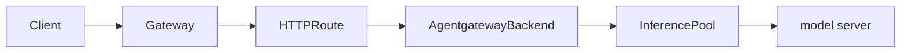

Use custom providers for unsupported, self-hosted, or non-standard LLM
targets when you want to declare the provider target and supported API formats
explicitly.

If your upstream already matches a first-class provider page, or the provider is 
generic OpenAI-compatible without special path or format handling,
use the standard provider guides instead of this custom provider guide.

Custom providers are useful when:

- The provider supports only a subset of OpenAI APIs, such as chat completions
  but not responses.
- The provider supports multiple API shapes, such as OpenAI chat completions and
  Anthropic messages.
- The provider uses non-default paths for one or more API formats.
- You want to use LLM features, such as token counting, rate limiting,
  guardrails, transformations, and observability, with an
   that routes to a Kubernetes
  Service or InferencePool.

For first-class providers such as OpenAI, Anthropic, Gemini, Vertex AI, Azure,
Bedrock, and Ollama, use the dedicated provider page unless you need explicit
format or backend target control. For providers that expose the standard OpenAI
API shape without a first-class type, such as Cohere, DeepSeek, Groq, Mistral,
Together AI, and xAI, use [OpenAI-compatible providers]() before using a custom provider.

## Supported targets

A custom provider must specify exactly one upstream target.

| Target | When to use |
|--------|-------------|
| `host` and `port` | Route to a DNS name or external endpoint. |
| `backendRef` to a Service | Route to a namespace-local Kubernetes Service. |
| `backendRef` to an InferencePool | Use Gateway API Inference Extension endpoint selection and agentgateway LLM features together. |

The `backendRef` must be namespace-local and can target only a Service or an
InferencePool. Service references require a port. InferencePool references do
not.

## Supported formats

Set `custom.formats` to declare the provider-native formats that the upstream
provider supports. You can also set `formats[].path` when the provider uses a
non-default path for that format.

| Format | Default upstream path |
|--------|-----------------------|
| `Completions` | `/v1/chat/completions` |
| `Messages` | `/v1/messages` |
| `Responses` | `/v1/responses` |
| `Embeddings` | `/v1/embeddings` |
| `AnthropicTokenCount` | `/v1/messages/count_tokens` |
| `Realtime` | `/v1/realtime` |
| `Rerank` | `/v1/rerank` |

Agentgateway chooses from the provider-native formats that you declare. For
example, if a custom provider supports OpenAI chat completions but not OpenAI
responses, declare only `Completions`. If the provider exposes multiple API
shapes, declare each supported format and optionally set a per-format path.

| Client request format | Preferred custom provider format |
|-----------------------|----------------------------------|
| OpenAI chat completions | `Completions`, then `Messages` |
| Anthropic messages | `Messages`, then `Completions`, then `Responses` |
| OpenAI responses | `Responses`, then `Completions` |
| OpenAI embeddings | `Embeddings` |
| Anthropic token count | `AnthropicTokenCount` |
| OpenAI realtime | `Realtime` |
| Rerank | `Rerank` |

If no declared provider format can serve the client request format,
agentgateway rejects the request.

When an Anthropic messages request is converted to a `Completions` or
`Responses` provider, the converted error starts with
`capability_rejected: prompt_too_long` if the upstream returns an HTTP 400
context-overflow error. The original upstream message follows the marker.
Clients such as Claude Code use the marker to compact the prompt and retry.
The marker is added for confirmed context-overflow errors, such as the
`context_length_exceeded` code or provider messages that say the prompt exceeds
the context window. Other HTTP statuses, unrelated error codes, and messages
that already contain `capability_rejected:` keep the upstream message.

### Reasoning carryover between formats

Extended-thinking history is carried between the `Messages` and `Completions`
formats in both directions, so a thinking session on a converted route keeps its
prior reasoning from one turn to the next. Self-hosted engines such as
[vLLM]() report
reasoning as `reasoning_content` and accept it back on an assistant message,
which is what makes the carryover possible.

For an Anthropic messages client that reaches a `Completions` provider, an
assistant `thinking` block in the message history is sent as
`reasoning_content`, and the `reasoning_content` in a response becomes a
`thinking` block ahead of the text block. In a stream, the thinking block opens
with `thinking_delta` events, adds a `signature_delta` when the engine sends a
signature, and stops before the text or tool-use block that follows.

For an OpenAI chat completions client that reaches a `Messages` provider, an
assistant message that carries `reasoning_content` together with a non-empty
`reasoning_signature` is replayed as a signed `thinking` block ahead of its text
and tool calls. The signature of a response thinking block is forwarded back as
`reasoning_signature`.

The following cases do not round-trip.

| Case | What happens |
|------|--------------|
| An unsigned `reasoning_content`, sent to a `Messages` provider | Left out, because the provider rejects a thinking block that has no signature. |
| A turn with more than one signed thinking block, sent to a `Completions` provider | The thinking text is joined into a single `reasoning_content`, but no `reasoning_signature` is sent. The signature is carried only when the turn has exactly one signed block. |
| A `redacted_thinking` block, sent to a `Completions` provider | Dropped, because it holds nothing that an OpenAI-compatible engine can replay. |
| A provider that declares `Responses` and not `Completions` | The thinking history is dropped from the converted request, with no error and no warning, so the model loses its prior reasoning. |

Certain models, such as `gpt-5.3`, reject a Chat Completions request that sets both a reasoning effort and tools. When an Anthropic messages client sends a request with tools to one of these models through a `Completions` provider, the request is sent with `reasoning_effort: "none"`, and any thinking that the client asked for through `thinking` or `output_config.effort` is dropped. Every other model receives the reasoning effort that the client asked for, if any.

## Set the provider identity {#provider-override}

A custom provider reports itself as `custom` in cost lookups and telemetry, because agentgateway has no first-class provider type to name it by. Every custom provider therefore shares one identity, which makes per-provider cost and usage impossible to separate.

Set `custom.providerOverride` to the identity that you want agentgateway to use instead. The following  routes to a self-hosted Llama model and reports it as `vllm` rather than as `custom`.

```yaml
apiVersion: agentgateway.dev/v1alpha1
kind: 
metadata:
  name: self-hosted-llama
  namespace: 
spec:
  ai:
    provider:
      custom:
        providerOverride: vllm
        model: llama3.2
        formats:
        - type: Completions
      host: llama..svc.cluster.local
      port: 8000
```

The value changes two things.

| Consumer | Effect |
| -- | -- |
| Model cost catalog | Agentgateway looks up the model price under this provider name. Without a match in the catalog, the request is not priced, and `llm.cost` stays unset. |
| Telemetry | The `gen_ai.provider.name` attribute on metrics, spans, and access logs carries this value rather than `custom`. |

Set the field on the , in `spec.ai.provider.custom` or `spec.ai.groups[].providers[].custom`, or on an . On a model, the field is in `spec.custom`.

> [!NOTE]
> Choose a value that matches the provider name in your [model cost catalog](). A value that no catalog entry uses is still reported in telemetry, but no cost is calculated for the request.

## Route to a host and port

Use `host` and `port` when the LLM provider is reachable by DNS name or IP
address. The following example declares that the provider supports both OpenAI
chat completions and Anthropic messages.

```yaml
apiVersion: agentgateway.dev/v1alpha1
kind: 
metadata:
  name: ollama-custom
  namespace: 
spec:
  ai:
    provider:
      custom:
        model: llama3.2
        formats:
        - type: Completions
          path: /v1/chat/completions
        - type: Messages
          path: /v1/messages
      host: ollama..svc.cluster.local
      port: 11434
```

## Route to a Service

Use a Service `backendRef` when the LLM provider runs behind a Kubernetes
Service in the same namespace as the .

```yaml
apiVersion: agentgateway.dev/v1alpha1
kind: 
metadata:
  name: local-llm
  namespace: 
spec:
  ai:
    provider:
      custom:
        backendRef:
          name: llm-service
          port: 8080
        model: llama3
        formats:
        - type: Completions
```

## Route to an InferencePool

Use an InferencePool `backendRef` when you want the Endpoint Picker Extension
(EPP) to select a model server, but you also want agentgateway to run the LLM
request and response pipeline.

With this flow, the route points to the ,
and the custom provider points to the InferencePool.



```yaml
apiVersion: agentgateway.dev/v1alpha1
kind: 
metadata:
  name: qwen-inferencepool
  namespace: 
spec:
  ai:
    provider:
      custom:
        backendRef:
          group: inference.networking.k8s.io
          kind: InferencePool
          name: vllm-qwen25-15b-instruct
        model: Qwen/Qwen2.5-1.5B-Instruct
        formats:
        - type: Completions
          path: /v1/chat/completions
---
apiVersion: gateway.networking.k8s.io/v1
kind: HTTPRoute
metadata:
  name: qwen
  namespace: 
spec:
  parentRefs:
  - name: agentgateway-proxy
    namespace: 
  rules:
  - matches:
    - path:
        type: PathPrefix
        value: /v1/chat/completions
    backendRefs:
    - group: agentgateway.dev
      kind: 
      name: qwen-inferencepool
```

> [!NOTE]
> Most users can keep the default llm-d Router OpenAI parser and send
> OpenAI-compatible requests, such as `/v1/chat/completions`. If clients send a
> different request format, configure the llm-d Router EPP parser, such as
> `router.epp.parser`, for that client-facing format. For parser options, see the
> [llm-d Router parser docs](https://github.com/llm-d/llm-d-router/blob/main/pkg/epp/framework/plugins/requesthandling/parsers/README.md).

## Limitations

- Custom providers cannot target another .
- Custom provider `backendRef` can target only namespace-local Services and
  InferencePools.
- Custom providers do not add arbitrary gRPC provider support.
- Do not combine provider-level `path` or `pathPrefix` with `formats[].path`.
  Use one path configuration style per provider.
- The `Detect` and `Passthrough` route modes are not custom provider formats.
  Use provider routes when you need those modes for a request path.
