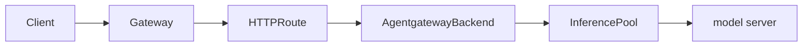

Use custom providers for unsupported, self-hosted, or non-standard LLM
targets when you want to declare the provider target and supported API formats
explicitly.

If your upstream already matches a first-class provider page, or the provider is 
generic OpenAI-compatible without special path or format handling,
use the standard provider guides instead of this custom provider guide.

Custom providers are useful when:

- The provider supports only a subset of OpenAI APIs, such as chat completions
  but not responses.
- The provider supports multiple API shapes, such as OpenAI chat completions and
  Anthropic messages.
- The provider uses non-default paths for one or more API formats.
- You want to use LLM features, such as token counting, rate limiting,
  guardrails, transformations, and observability, with an
   that routes to a Kubernetes
  Service or InferencePool.

For first-class providers such as OpenAI, Anthropic, Gemini, Vertex AI, Azure,
Bedrock, and Ollama, use the dedicated provider page unless you need explicit
format or backend target control. For providers that expose the standard OpenAI
API shape without a first-class 
type, such as Cohere, DeepSeek, Groq, Mistral, Perplexity, Together AI, and xAI,
use [OpenAI-compatible providers]() before using a custom provider.

## Supported targets

A custom provider must specify exactly one upstream target.

| Target | When to use |
|--------|-------------|
| `host` and `port` | Route to a DNS name or external endpoint. |
| `backendRef` to a Service | Route to a namespace-local Kubernetes Service. |
| `backendRef` to an InferencePool | Use Gateway API Inference Extension endpoint selection and agentgateway LLM features together. |

The `backendRef` must be namespace-local and can target only a Service or an
InferencePool. Service references require a port. InferencePool references do
not.

## Supported formats

Set `custom.formats` to declare the provider-native formats that the upstream
provider supports. You can also set `formats[].path` when the provider uses a
non-default path for that format.

| Format | Default upstream path |
|--------|-----------------------|
| `Completions` | `/v1/chat/completions` |
| `Messages` | `/v1/messages` |
| `Responses` | `/v1/responses` |
| `Embeddings` | `/v1/embeddings` |
| `AnthropicTokenCount` | `/v1/messages/count_tokens` |
| `Realtime` | `/v1/realtime` |
| `Rerank` | `/v1/rerank` |

Agentgateway chooses from the provider-native formats that you declare. For
example, if a custom provider supports OpenAI chat completions but not OpenAI
responses, declare only `Completions`. If the provider exposes multiple API
shapes, declare each supported format and optionally set a per-format path.

| Client request format | Preferred custom provider format |
|-----------------------|----------------------------------|
| OpenAI chat completions | `Completions`, then `Messages` |
| Anthropic messages | `Messages`, then `Responses`, then `Completions` |
| OpenAI responses | `Responses`, then `Completions` |
| OpenAI embeddings | `Embeddings` |
| Anthropic token count | `AnthropicTokenCount` |
| OpenAI realtime | `Realtime` |
| Rerank | `Rerank` |

If no declared provider format can serve the client request format,
agentgateway rejects the request.

An error such as `failed to parse Messages request` names the route type that
parsed the client request before provider conversion. Check that the request
path maps to the expected route type and that the body matches that format.

When a provider declares both `Responses` and `Completions`, agentgateway prefers
Responses for Anthropic messages requests. This order also applies to the built-in
`openai` provider and to `azure` for models other than Claude. On an
, it also applies to
`Ollama`, `Groq`, `Huggingface`, and `XAI`.

The Responses conversion drops extended-thinking history. The Chat Completions
conversion preserves it. To preserve this history, declare `Completions` and
omit `Responses`.

Use the `openai` provider only for the OpenAI API. For other OpenAI-compatible
servers, use a custom provider with the formats that the server supports.
If the server does not support `/v1/responses`, declare `Completions` and omit
`Responses`.

For providers that support both formats, the
`AGENTGATEWAY_MESSAGES_PREFER_COMPLETIONS` environment variable provides a
temporary workaround for Responses conversion bugs. To prefer Chat Completions,
set this variable to `true` in `spec.env` of the
 resource.
The variable applies to every provider and is planned for removal in version 1.7.
For an example, see [Add environment variables]().

### Converted replies and errors

When an Anthropic messages request is converted to the `Responses` or the
`Completions` format, the reply is converted back with these behaviors.

- A reply that the provider stops for content filtering returns
  `stop_reason: "refusal"`, in both the buffered and the streamed form. The
  provider signals content filtering as `finish_reason: "content_filter"` in
  Chat Completions, and as a refusal or
  `incomplete_details.reason: "content_filter"` in Responses.
- A function call with empty arguments becomes a `tool_use` block whose `input`
  is `{}`. When the reply reaches the output token limit partway through the
  arguments, `stop_reason` is `max_tokens`, and a buffered reply returns the
  partial arguments in `input` as a string instead of an object. Check
  `stop_reason` before you parse `input`.
- When the provider rejects a prompt that is longer than the model's context
  window, the converted error message starts with
  `capability_rejected: prompt_too_long`, followed by the original message.
  Clients such as Claude Code use this marker to compact the prompt and retry.
  The marker is added only to an HTTP 400 error that has the
  `context_length_exceeded` code, or that has no code and a message that says
  the prompt exceeds the context window. An error that already contains
  `capability_rejected:` keeps its message. A Gemini or Vertex AI provider
  returns errors in the Google format, which does not get the marker.
- Response usage follows the API format that the client called. Messages
  responses use Anthropic usage conventions, so `usage.input_tokens` excludes
  prompt-cache tokens. Chat Completions and Responses replies use OpenAI usage
  conventions. In those replies, the main input count includes prompt-cache
  tokens.
- When a streamed reply in the `Responses` format fails, the converted Messages
  stream emits the content blocks that arrived before the failure, then emits
  an Anthropic `error` event. After the error, the stream does not emit
  `message_delta` or `message_stop`, and later Responses events are ignored.

### Anthropic messages to the Responses format

The Responses conversion covers text, system instructions, images, function
tools, tool-use history, tool results that are text or images, structured
output, prompt cache breakpoints, and streaming. A function tool that omits
`strict` is sent with `strict: false`, so that the optional properties of its
input schema stay optional. A structured output JSON schema is sent with
`text.format.strict` set to `false`, so that optional schema properties stay
optional. The reasoning effort, from `output_config.effort` or
from a `thinking` budget, is sent as `reasoning.effort`. A request that sets
`thinking.type` to `disabled` sends no reasoning setting.

The following Messages features are dropped from the converted request, with no
error and no warning to the client.

- Thinking and redacted-thinking history, so the model loses its prior
  reasoning on each turn
- The `stop_sequences` and `top_k` fields, so a request that relies on a stop
  sequence to end generation behaves differently
- Citations on text blocks in the message history. The text itself is kept.
- Document, search-result, and server-tool content blocks, and content blocks
  of a type that agentgateway does not recognize
- Server tools, such as web search, in the `tools` list

In the reply, the reasoning output of the model is dropped, so the reply has no
`thinking` block. A buffered reply keeps each URL citation as a
`web_search_result_location` citation with the source `url` and `title`. The
`cited_text` and `encrypted_index` fields are empty strings, because the
Responses format does not return them. File citations and `logprobs` are
dropped. A streamed reply has no citations.

### Reasoning carryover between formats

Extended-thinking history is carried between the `Messages` and `Completions`
formats in both directions, so a thinking session on a converted route keeps its
prior reasoning from one turn to the next. Self-hosted engines such as
[vLLM]() report
reasoning as `reasoning_content` and accept it back on an assistant message,
which is what makes the carryover possible.

For an Anthropic messages client that reaches a `Completions` provider, an
assistant `thinking` block in the message history is sent as
`reasoning_content`, and the `reasoning_content` in a response becomes a
`thinking` block ahead of the text block. In a stream, the thinking block opens
with `thinking_delta` events, adds a `signature_delta` when the engine sends a
signature, and stops before the text or tool-use block that follows.

For an OpenAI chat completions client that reaches a `Messages` provider, an
assistant message that carries `reasoning_content` together with a non-empty
`reasoning_signature` is replayed as a signed `thinking` block ahead of its text
and tool calls. The signature of a response thinking block is forwarded back as
`reasoning_signature`.

The following cases do not round-trip.

| Case | What happens |
|------|--------------|
| An unsigned `reasoning_content`, sent to a `Messages` provider | Left out, because the provider rejects a thinking block that has no signature. |
| A turn with more than one signed thinking block, sent to a `Completions` provider | The thinking text is joined into a single `reasoning_content`, but no `reasoning_signature` is sent. The signature is carried only when the turn has exactly one signed block. |
| A `redacted_thinking` block, sent to a `Completions` provider | Dropped, because it holds nothing that an OpenAI-compatible engine can replay. |
| An Anthropic messages request that takes the Responses conversion instead | The thinking history is dropped from the converted request, with no error and no warning, so the model loses its prior reasoning. See [Anthropic messages to the Responses format](#anthropic-messages-to-the-responses-format). |

Certain models, such as `gpt-5.3`, reject a Chat Completions request that sets both a reasoning effort and tools. When an Anthropic messages client sends a request with tools to one of these models through a `Completions` provider, the request is sent with `reasoning_effort: "none"`, and any thinking that the client asked for through `thinking` or `output_config.effort` is dropped. Every other model receives the reasoning effort that the client asked for, if any.

### Anthropic messages to the Completions format

Agentgateway converts an Anthropic messages request to Chat Completions when the
provider declares `Completions` and omits `Responses`. For providers that support
both formats, you can use the `AGENTGATEWAY_MESSAGES_PREFER_COMPLETIONS=true`
workaround. The conversion preserves reasoning history and handles the following
fields.

| Field | What happens |
|-------|--------------|
| `output_config.effort` | Sent as `reasoning_effort`, even when the request omits `thinking`. Without `output_config.effort`, the effort comes from the `thinking` budget. A request that sets `thinking.type` to `disabled` sends no `reasoning_effort`. |
| `tools[].strict` | Kept as set. A tool that omits `strict` is sent without it. |
| `stop_sequences` | Sent as `stop`. When the reply has `finish_reason: "stop"` and a string in the vLLM `stop_reason` field or the SGLang `matched_stop` field, the Messages reply has `stop_reason: "stop_sequence"` and that string in `stop_sequence`. A numeric stop-token ID is ignored, so a natural end of turn still returns `stop_reason: "end_turn"`. |

## Set the provider identity {#provider-override}

A custom provider reports itself as `custom` in cost lookups and telemetry, because agentgateway has no first-class provider type to name it by. Every custom provider therefore shares one identity, which makes per-provider cost and usage impossible to separate.

Set `custom.providerOverride` to the identity that you want agentgateway to use instead. The following  routes to a self-hosted Llama model and reports it as `vllm` rather than as `custom`.

```yaml
apiVersion: agentgateway.dev/v1alpha1
kind: 
metadata:
  name: self-hosted-llama
  namespace: 
spec:
  ai:
    provider:
      custom:
        providerOverride: vllm
        model: llama3.2
        formats:
        - type: Completions
      host: llama..svc.cluster.local
      port: 8000
```

The value changes two things.

| Consumer | Effect |
| -- | -- |
| Model cost catalog | Agentgateway looks up the model price under this provider name. Without a match in the catalog, the request is not priced, and `llm.cost` stays unset. |
| Telemetry | The `gen_ai.provider.name` attribute on metrics, spans, and access logs carries this value rather than `custom`. |

Set the field on the , in `spec.ai.provider.custom` or `spec.ai.groups[].providers[].custom`, or on an . On a model, the field is in `spec.custom`.

> [!NOTE]
> Choose a value that matches the provider name in your [model cost catalog](). A value that no catalog entry uses is still reported in telemetry, but no cost is calculated for the request.

## Route to a host and port

Use `host` and `port` when the LLM provider is reachable by DNS name or IP
address. The following example declares that the provider supports both OpenAI
chat completions and Anthropic messages.

```yaml
apiVersion: agentgateway.dev/v1alpha1
kind: 
metadata:
  name: ollama-custom
  namespace: 
spec:
  ai:
    provider:
      custom:
        model: llama3.2
        formats:
        - type: Completions
          path: /v1/chat/completions
        - type: Messages
          path: /v1/messages
      host: ollama..svc.cluster.local
      port: 11434
```

## Route to a Service

Use a Service `backendRef` when the LLM provider runs behind a Kubernetes
Service in the same namespace as the .

```yaml
apiVersion: agentgateway.dev/v1alpha1
kind: 
metadata:
  name: local-llm
  namespace: 
spec:
  ai:
    provider:
      custom:
        backendRef:
          name: llm-service
          port: 8080
        model: llama3
        formats:
        - type: Completions
```

## Route to an InferencePool

Use an InferencePool `backendRef` when you want the Endpoint Picker Extension
(EPP) to select a model server, but you also want agentgateway to run the LLM
request and response pipeline.

With this flow, the route points to the ,
and the custom provider points to the InferencePool.


```mermaid
graph LR
    Client --> Gateway
    Gateway --> HTTPRoute
    HTTPRoute --> AgentgatewayBackend
    AgentgatewayBackend --> InferencePool
    InferencePool --> ModelServer["model server"]
```

```yaml
apiVersion: agentgateway.dev/v1alpha1
kind: 
metadata:
  name: qwen-inferencepool
  namespace: 
spec:
  ai:
    provider:
      custom:
        backendRef:
          group: inference.networking.k8s.io
          kind: InferencePool
          name: vllm-qwen25-15b-instruct
        model: Qwen/Qwen2.5-1.5B-Instruct
        formats:
        - type: Completions
          path: /v1/chat/completions
---
apiVersion: gateway.networking.k8s.io/v1
kind: HTTPRoute
metadata:
  name: qwen
  namespace: 
spec:
  parentRefs:
  - name: agentgateway-proxy
    namespace: 
  rules:
  - matches:
    - path:
        type: PathPrefix
        value: /v1/chat/completions
    backendRefs:
    - group: agentgateway.dev
      kind: 
      name: qwen-inferencepool
```

> [!NOTE]
> Most users can keep the default llm-d Router OpenAI parser and send
> OpenAI-compatible requests, such as `/v1/chat/completions`. If clients send a
> different request format, configure the llm-d Router EPP parser, such as
> `router.epp.parser`, for that client-facing format. For parser options, see the
> [llm-d Router parser docs](https://github.com/llm-d/llm-d-router/blob/main/pkg/epp/framework/plugins/requesthandling/parsers/README.md).

## Limitations

- Custom providers cannot target another .
- Custom provider `backendRef` can target only namespace-local Services and
  InferencePools.
- Custom providers do not add arbitrary gRPC provider support.
- Do not combine provider-level `path` or `pathPrefix` with `formats[].path`.
  Use one path configuration style per provider.
- The `Detect` and `Passthrough` route modes are not custom provider formats.
  Use provider routes when you need those modes for a request path.
