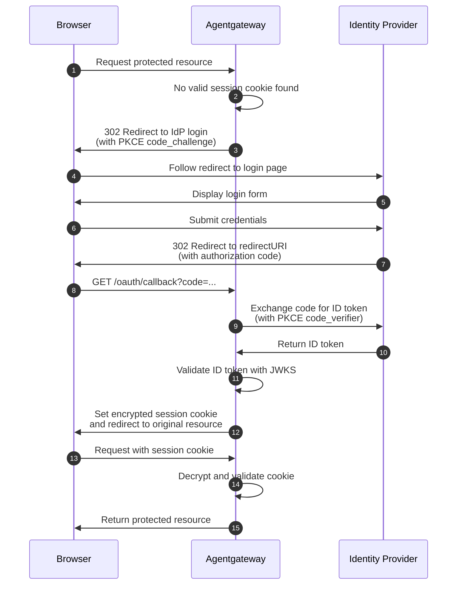

Attaches to: 



OIDC browser authentication provides built-in OpenID Connect login for browser-based clients. By default, unauthenticated browser navigation requests are redirected to the identity provider's login page, and unauthenticated fetch requests receive a `401 Unauthorized` response. Additionally, you can send browser navigation requests to a local login page before the identity provider flow starts, and add a local logout endpoint that clears the gateway session. After successful authentication, the user's session is maintained with encrypted cookies.

The OIDC policy uses the OAuth 2.0 Authorization Code Flow with PKCE (Proof Key for Code Exchange) for secure browser-based authentication without requiring a separate proxy like oauth2-proxy.

## About

The following diagram shows the OIDC browser authentication flow between the browser, agentgateway, and identity provider.



* **Steps 1-3: Unauthenticated request**. When a browser navigation arrives without a valid session cookie, the gateway redirects the user to the identity provider's login page.
* **Steps 4-6: Login**. The user authenticates with the identity provider.
* **Steps 7-8: Callback**. After login, the identity provider redirects back to the `redirectURI` with an authorization code.
* **Steps 9-11: Token exchange**. The gateway exchanges the authorization code for an ID token using PKCE.
* **Steps 12-15: Session cookie**. The gateway sets an encrypted session cookie containing the ID token claims. Subsequent requests use this cookie.

### Navigation and fetch requests {#navigation-and-fetch-requests}

The gateway reads the `Sec-Fetch-Mode` request header that browsers send to tell a page navigation apart from a script request.

- Requests with `Sec-Fetch-Mode` set to `cors`, `no-cors`, `same-origin`, or `websocket`, such as `fetch()` calls, receive `401 Unauthorized` instead of a redirect to the identity provider.
- If you set `login.redirect`, the `401` response also includes a `Location` header with that page, so that your application can send the user there. For more information, see [Custom login page and logout](#custom-login-page-and-logout).
- Requests without a `Sec-Fetch-Mode` header, such as `curl` requests, are treated as navigation requests and redirected.

### Session cookies {#session-cookies}

Review the following details about session cookies.

- Session cookies are encrypted and tamper-proof.
- Session cookie payloads are compressed only when the result is smaller. Compression helps ID tokens with large claim sets fit in browser cookie limits.
- Session cookies written before compression continue to decode.
- A protected response can include its own cookies and the OIDC session cookie.
- The gateway always requests the `openid` scope to obtain an ID token.
- If the identity provider returns a refresh token, a separate encrypted cookie stores it. The browser session refreshes when the ID token expires. Add the `offline_access` scope when your provider requires that scope to issue refresh tokens.
- The refresh response must include a new ID token for the same `sub` claim. If the provider omits the ID token, the user must sign in again. If the provider returns an ID token for a different subject, the user must sign in again.
- With multiple gateway replicas and rotating refresh tokens, configure the provider's refresh-token reuse grace period to tolerate concurrent refreshes from different replicas.
- The gateway uses PKCE automatically to protect against authorization code interception.

## Configuration

Add the `oidc` policy to a route to protect it with browser-based OIDC authentication.

Agentgateway requires the `OIDC_COOKIE_SECRET` environment variable to encrypt session cookies when an `oidc` policy is configured. Set it to a random value before you start the gateway, such as in the following example.

```bash
export OIDC_COOKIE_SECRET="$(python3 -c 'import os; print(os.urandom(32).hex())')"
```



```yaml
# yaml-language-server: $schema=https://agentgateway.dev/schema/config
llm:
  policies:
    oidc:
      issuer: http://localhost:7080/realms/agentgateway
      clientId: agentgateway-browser
      clientSecret: agentgateway-secret
      redirectURI: http://localhost:3000/oauth/callback
      scopes:
      - profile
      - email
  models:
  - name: "*"
    provider: openAI
    params:
      apiKey: "$OPENAI_API_KEY"
```


```yaml
# yaml-language-server: $schema=https://agentgateway.dev/schema/config
mcp:
  port: 3000
  policies:
    oidc:
      issuer: http://localhost:7080/realms/agentgateway
      clientId: agentgateway-browser
      clientSecret: agentgateway-secret
      redirectURI: http://localhost:3000/oauth/callback
      scopes:
      - profile
      - email
  targets:
  - name: everything
    stdio:
      cmd: npx
      args: ["@modelcontextprotocol/server-everything"]
```


```yaml
# yaml-language-server: $schema=https://agentgateway.dev/schema/config
gateways:
  default:
    port: 3000
routes:
- backends:
  - host: localhost:18080
  matches:
  - path:
      pathPrefix: /
  policies:
    oidc:
      issuer: http://localhost:7080/realms/agentgateway
      clientId: agentgateway-browser
      clientSecret: agentgateway-secret
      redirectURI: http://localhost:3000/oauth/callback
      scopes:
      - profile
      - email
```



### Keycloak example

Review the following example for a Keycloak IdP.



```yaml
# yaml-language-server: $schema=https://agentgateway.dev/schema/config
llm:
  policies:
    oidc:
      issuer: http://keycloak.example.com/realms/myrealm
      clientId: agentgateway-browser
      clientSecret: my-client-secret
      redirectURI: http://localhost:3000/oauth/callback
      scopes:
      - profile
      - email
  models:
  - name: "*"
    provider: openAI
    params:
      apiKey: "$OPENAI_API_KEY"
```


```yaml
# yaml-language-server: $schema=https://agentgateway.dev/schema/config
mcp:
  port: 3000
  policies:
    oidc:
      issuer: http://keycloak.example.com/realms/myrealm
      clientId: agentgateway-browser
      clientSecret: my-client-secret
      redirectURI: http://localhost:3000/oauth/callback
      scopes:
      - profile
      - email
  targets:
  - name: everything
    stdio:
      cmd: npx
      args: ["@modelcontextprotocol/server-everything"]
```


```yaml
# yaml-language-server: $schema=https://agentgateway.dev/schema/config
gateways:
  default:
    port: 3000
routes:
- backends:
  - host: localhost:18080
  matches:
  - path:
      pathPrefix: /
  policies:
    oidc:
      issuer: http://keycloak.example.com/realms/myrealm
      clientId: agentgateway-browser
      clientSecret: my-client-secret
      redirectURI: http://localhost:3000/oauth/callback
      scopes:
      - profile
      - email
```


For a complete runnable setup, including a Compose file that starts a preconfigured local Keycloak instance, see the [`traffic-oidc` example](https://github.com/agentgateway/agentgateway/tree/main/examples/traffic-oidc) in the agentgateway repository.

{}



## Custom login page and logout {#custom-login-page-and-logout}

Use `login` to show your application's sign-in page before the identity provider flow, and `logout` to add a sign-out control that clears the gateway session. You can configure either block independently. The following example enables both; see [Fields](#fields) for defaults and path requirements.

```yaml
policies:
  oidc:
    issuer: http://localhost:7080/realms/agentgateway
    clientId: agentgateway-browser
    clientSecret: agentgateway-secret
    redirectURI: http://localhost:3000/oauth/callback
    login:
      path: /auth/login
      redirect: /login
    logout:
      path: /auth/logout
      redirect: /login
```

For this example, serve `/login` and its assets on public routes that bypass OIDC. On that page, link to `/auth/login` and preserve the `returnTo` query parameter. For example, `/login?returnTo=%2Fapp` uses `/auth/login?returnTo=%2Fapp` as its sign-in link.

Use a same-origin `POST` form for logout, such as the following example.

```html
<form method="post" action="/auth/logout">
  <button type="submit">Sign out</button>
</form>
```

> [!IMPORTANT]
> Make the logout destination public through a route or a policy that bypasses OIDC. If the destination is protected, the next request starts a new login. The user's identity provider session is still active, so the user can be signed back in without a prompt and logout appears to do nothing.

## Fields



All `login` and `logout` endpoint and redirect values must be safe local paths. The built-in UI manages its own `/ui/login`, `/api/auth/login`, and `/api/auth/logout` endpoints and rejects `login` or `logout` under `ui.policies.oidc`.

| Field | Required | Description |
|-------|----------|-------------|
| `issuer` | Yes | OIDC provider issuer URL. Used for discovery and ID token validation. |
| `clientId` | Yes | OAuth2 client identifier registered with your identity provider. |
| `clientSecret` | Yes | OAuth2 client secret for token exchange. |
| `redirectURI` | Yes | Absolute callback URI handled by the gateway, such as `http://localhost:3000/oauth/callback`. |
| `scopes` | No | Additional OAuth2 scopes to request. `openid` is always included automatically. Add `offline_access` when your identity provider requires that scope to issue refresh tokens. Returned refresh tokens are used automatically. |
| `discovery` | No | Override the OIDC discovery document location. If omitted, uses `${issuer}/.well-known/openid-configuration`. |
| `authorizationEndpoint` | No | Explicit authorization endpoint. Overrides the value from discovery. |
| `tokenEndpoint` | No | Explicit token endpoint. Overrides the value from discovery. |
| `tokenEndpointAuth` | No | Client authentication method for the token endpoint. Discovery mode derives this from provider metadata. Explicit mode defaults to `clientSecretBasic`. |
| `jwks` | No | JWKS source for ID token validation. If omitted, uses the `jwks_uri` from discovery. |
| `login` | No | Optional explicit login endpoint and pre-login redirect block. Omit to keep automatic redirects to the identity provider. |
| `login.path` | Yes, when `login` is set | Endpoint that starts the OIDC flow, handled by the policy without forwarding to your application. The configured path must have no query string and differ from `logout.path` and the callback path. Requests can include `returnTo` to select the destination after login; missing or unsafe values default to `/`. |
| `login.redirect` | No | Application page shown before authentication, separate from the callback and the destination after login. Serve it and its assets on public routes; this setting does not make them public. Must differ from the login, logout, and callback paths. The gateway appends `returnTo` with the original path and query. Omit to start the identity provider flow directly. For fetch behavior, see [Navigation and fetch requests](#navigation-and-fetch-requests). |
| `logout` | No | Optional local logout endpoint block. Omit to disable local logout. Does not sign the user out of the identity provider or revoke tokens. |
| `logout.path` | Yes, when `logout` is set | Endpoint that clears the policy's session and login transaction cookies. Requires a `POST` request with an `Origin` header matching the origin of `redirectURI`. The configured path must have no query string and differ from `login.path` and the callback path. |
| `logout.redirect` | No | Local destination for the `303` redirect after logout. Defaults to `login.redirect` when set, or `/` when `login.redirect` is omitted. Make this destination public, or the next request starts a new login. |

## Access log enrichment

After setting up OIDC browser authentication, you can use JWT claims from the OIDC session in access logs. Add a frontend policy such as the following example.

```yaml
frontendPolicies:
  accessLog:
    add:
      user.id: jwt.sub
      user.email: jwt.email
```

## Learn more

- [Keycloak integration]()
- [Auth0 integration]()
- [MCP authentication]() for MCP-specific OAuth flows
