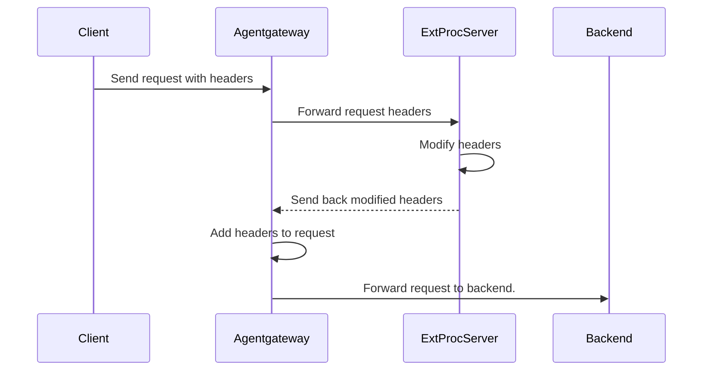





Attaches to:  

External processing is an advanced filter that allows arbitrary modifications to HTTP requests and responses with an external processing server.

Agentgateway is API-compatible with Envoy's [External Processing gRPC service](https://www.envoyproxy.io/docs/envoy/latest/api-v3/service/ext_proc/v3/external_processor.proto).

## About external processing

With agentgateway's external processing (ExtProc) integration, you can implement an external gRPC processing server that can read and modify all aspects of an HTTP request or response. Agentgateway extracts specific information from the request or response, such as the headers, the body, or trailers, and automatically forwards them to the ExtProc server. The ExtProc server then manipulates these attributes according to your rules and returns the modified attributes. Agentgateway injects the modified attributes before forwarding traffic to an upstream or downstream service. The request or response can also be terminated at any given time.

## How it works



1. The client sends a request with headers to agentgateway.
2. Agentgateway extracts the header information and sends it to the external processing server.
3. The external processing server modifies, adds, or removes the request headers.
4. The modified request headers are sent back to agentgateway.
5. The modified headers are added to the request.
6. The request is forwarded to the backend service.

## Failure modes {#failure-modes}

You can choose whether you want agentgateway to forward requests if the external processing server is unavailable with the `extProc.failureMode` setting. Choose between the following modes: 

* **failOpen**: Forward requests to the backend service, even if the connection to the external processing server fails. You might choose this option to ensure availability of the backend services even when the ExtProc service is down.
* **failClosed**: Block requests if the request to the external processing server fails. This is the default behavior.

By default, agentgateway waits 10 seconds for the external processing server to answer when opening a processing stream. When the wait runs out, the call counts as a failure and the `failureMode` setting decides what happens to the request. To use a different timeout, set `extProc.policies.http.requestTimeout`.

If the connection fails before request-body streaming to the external processing server starts, `failOpen` forwards the original body to the backend. `failClosed` returns an error instead. This behavior applies to streamed request body processing, including `extProc.processingOptions.requestBodyMode: fullDuplexStreamed`.

## Compatibility

The [External Processing gRPC service](https://www.envoyproxy.io/docs/envoy/latest/api-v3/service/ext_proc/v3/external_processor.proto) was designed for Envoy,
and includes a number of Envoy-specific fields that do not make sense outside of Envoy.
Although agentgateway aims to support the API as closely as possible, there are some gaps.

A non-exhaustive list of these gaps is as follows:
* Response header and response body modifications are supported, but only during the matching response phase.
* `dynamic_metadata` is accepted from request and response header responses. `dynamic_metadata` sent after headers have already been processed is ignored.
* `mode_override` is applied only when `processingOptions.allowModeOverride` is set to `true`, and only from the matching request or response header phase. Body-phase `mode_override` values and overrides received after full-duplex streaming starts are ignored.
* `override_message_timeout` is ignored in all responses.
* `clear_route_cache` is ignored in responses. Agentgateway does not have a route cache.
* `status.CONTINUE_AND_REPLACE` is ignored in responses.

`ImmediateResponse` is supported from request header, request body, response header, and response body phases. If the external processor returns an `ImmediateResponse`, agentgateway stops the current exchange and returns that response to the downstream client.

If any incompatibility causes issues for your external processing server, open an issue on the [agentgateway GitHub repository](https://github.com/agentgateway/agentgateway/issues).

## Setup

External processing is applied at the route level.

```yaml
# yaml-language-server: $schema=https://agentgateway.dev/schema/config
gateways:
  default:
    port: 3000
routes:
- backends:
  - ai:
     name: openai
     provider:
       openAI:
         # Optional; overrides the model in requests
         model: gpt-3.5-turbo
  policies:
    backendAuth:
      key: "$OPEN_AI_APIKEY"
    extProc:
      host: "extproc.com:9000"
      failureMode: failClosed
```

## Configure processing options

By default, ExtProc sends request headers, response headers, request trailers, and response trailers to the external processing service, and streams request and response bodies. To change which request or response phases are sent to the processor, configure `extProc.processingOptions`.

> [!NOTE]
> The default body mode is `fullDuplexStreamed`. If the external processor must inspect a complete body before agentgateway forwards it, use `buffered` or `bufferedPartial` and account for the gateway's body buffer limit, which defaults to 2 MiB, or 32 MiB for requests that enter LLM processing. To change the limit, set `frontendPolicies.http.maxBufferSize`. For general request and response body buffering outside of ExtProc, see [Body buffering]().

| Field | Default | Values | Description |
| --- | --- | --- | --- |
| `extProc.processingOptions.requestHeaderMode` | `send` | `send`, `skip` | Send or skip request headers. |
| `extProc.processingOptions.responseHeaderMode` | `send` | `send`, `skip` | Send or skip response headers. |
| `extProc.processingOptions.requestBodyMode` | `fullDuplexStreamed` | `none`, `buffered`, `bufferedPartial`, `fullDuplexStreamed` | Control how request bodies are sent. `none` skips the body. `buffered` buffers the full body and returns an error if the body is larger than the gateway's body buffer limit, 2 MiB by default. `bufferedPartial` buffers up to that limit and sends the buffered prefix if the body is larger. `fullDuplexStreamed` streams the body to the external processor. |
| `extProc.processingOptions.responseBodyMode` | `fullDuplexStreamed` | `none`, `buffered`, `bufferedPartial`, `fullDuplexStreamed` | Control how response bodies are sent. The body modes behave the same as `requestBodyMode`, but apply to upstream responses. |
| `extProc.processingOptions.requestTrailerMode` | `send` | `send`, `skip` | Send or skip request trailers. |
| `extProc.processingOptions.responseTrailerMode` | `send` | `send`, `skip` | Send or skip response trailers. |
| `extProc.processingOptions.allowModeOverride` | `false` | `true`, `false` | Allow `mode_override` values returned by the external processor in matching header responses to update later request and response processing phases for the same exchange. |

The following example sends headers and trailers, buffers request bodies up to the body buffer limit, skips response bodies, and allows the external processor to override later processing phases after a matching header response.

```yaml
# yaml-language-server: $schema=https://agentgateway.dev/schema/config
gateways:
  default:
    port: 3000
routes:
- backends:
  - mcp:
      targets:
      - name: default
        sse:
          host: mcp.example.com
          port: 8080
          path: /sse
  policies:
    extProc:
      host: "extproc.com:9000"
      failureMode: failClosed
      processingOptions:
        requestHeaderMode: send
        responseHeaderMode: send
        requestBodyMode: bufferedPartial
        responseBodyMode: none
        requestTrailerMode: send
        responseTrailerMode: send
        allowModeOverride: true
```

You can also set `processingOptions` inside a conditional ExtProc policy. Each conditional policy entry can use different phase settings.

```yaml
# yaml-language-server: $schema=https://agentgateway.dev/schema/config
gateways:
  default:
    port: 3000
routes:
- backends:
  - mcp:
      targets:
      - name: default
        sse:
          host: mcp.example.com
          port: 8080
          path: /sse
  policies:
    extProc:
      conditional:
      - condition: 'request.path.startsWith("/upload")'
        host: "extproc.com:9000"
        processingOptions:
          requestBodyMode: buffered
          responseBodyMode: none
      - host: "extproc.com:9000"
        processingOptions:
          requestBodyMode: none
          responseBodyMode: none
```

## Conditional execution

To send only certain requests through external processing, use the `conditional` field. For example, you can route LLM chat traffic through a content filter and bypass the processor for every other request. For details, see [Conditional policies]().

## Choose the destination from external processing {#dynamic-target}

A dynamic backend dials whatever destination the request itself names, taken from the `:authority` header or the URI. That works when the client already knows where the request should go, but not when an external processor is the thing that decides, such as a control plane that picks a worker pod per request.

An external processor can already return Envoy's standard `dynamic_metadata` alongside its verdict, and agentgateway exposes that metadata to CEL as `extproc.*`. Set a `target` expression on the dynamic backend to dial the destination directly from that metadata, rather than making the processor rewrite the request authority to communicate it.

```yaml
# yaml-language-server: $schema=https://agentgateway.dev/schema/config
gateways:
  default:
    port: 3000
routes:
- policies:
    extProc:
      host: "extproc.com:9000"
  backends:
  - dynamic:
      target: 'extproc.workerIp + ":" + string(extproc.workerPort)'
```


# WHAT THIS TEST VALIDATES:
#   * A dynamic backend accepts a `target` CEL expression alongside an extProc policy.
#   * Omitting `target` still validates, which is the pre-1.5 behavior the page describes.
# WHAT THIS TEST DOES NOT VALIDATE (and why):
#   * That the expression resolves at request time -- that needs a running external
#     processor that returns dynamic metadata, which this guide does not stand up.
cat <<'EOF' > config-dynamic-target.yaml
# yaml-language-server: $schema=https://agentgateway.dev/schema/config
gateways:
  default:
    port: 3000
routes:
- policies:
    extProc:
      host: "extproc.com:9000"
  backends:
  - dynamic:
      target: 'extproc.workerIp + ":" + string(extproc.workerPort)'
EOF
agentgateway -f config-dynamic-target.yaml --validate-only
cat <<'EOF' > config-dynamic-notarget.yaml
# yaml-language-server: $schema=https://agentgateway.dev/schema/config
gateways:
  default:
    port: 3000
routes:
- backends:
  - dynamic: {}
EOF
agentgateway -f config-dynamic-notarget.yaml --validate-only


| Field | Required | Description |
| -- | -- | -- |
| `dynamic.target` | No | CEL expression that computes the destination to dial. It must evaluate to a `host:port` string. When you omit it, agentgateway dials the destination that the request names, which is the behavior of a dynamic backend in earlier versions. |

Agentgateway resolves the destination in a fixed order: an in-process override first, then the `target` expression, and finally the destination that the request names.

Which CEL variables the expression can read depends on the route type.

| Route type | Available to the expression | Fallback when `target` is unset |
| -- | -- | -- |
| HTTP route | The full request context, including `extproc.*` metadata that an `extProc` policy returned. | The request's `:authority` header or URI. |
| TCP route | `source.*` and `destination.*`, where `destination.hostname` is the sniffed TLS SNI. | The sniffed SNI hostname and port. A TCP request that carries no SNI fails. |

Review the following limits.

- **The expression must return a string.** A value of any other type fails the request with `dynamic backend target expression must evaluate to a host:port string`.
- **`inferenceRouting` cannot be combined with a dynamic backend.** A request that hits both fails with `inferenceRouting is not supported with dynamic backends`.

> [!WARNING]
> The expression selects the address that agentgateway connects to, so whatever supplies its input decides where traffic goes. When the expression reads `extproc.*`, you are trusting the external processor to choose the destination. Treat that processor as part of the gateway's trust boundary, run it over a connection you control, and do not build the target from client-supplied headers.
