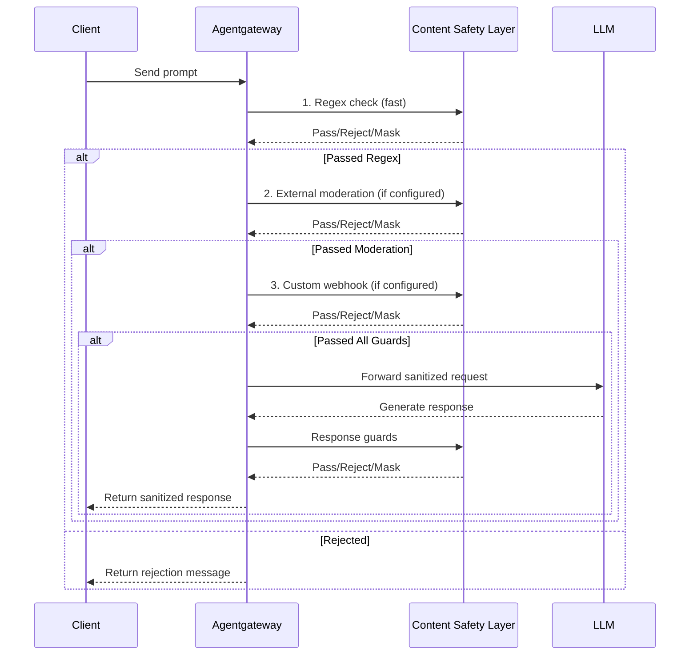

Protect LLM requests and responses from sensitive data exposure and harmful content using layered content safety controls.

## About

In agentgateway, you can use guardrails to help prevent sensitive information from reaching LLM providers and block harmful content in both requests and responses. Guardrails broadly cover a range of content safety techniques including personally identifiable information (PII) detection, PII sanitization, data loss prevention, prompt guards, and other guardrail features.

You can layer multiple protection mechanisms to create comprehensive guardrail protection:
- **Regex-based filters**: Fast, deterministic matching for known patterns like credit cards, SSNs, emails, and custom patterns
- **External moderation**: Leverage built-in model moderation endpoints and cloud provider-specific guardrails for advanced content filtering
- **Custom webhooks**: Integrate your own content safety logic for specialized requirements

## How guardrails works

Agentgateway checks for content safety in the request and response paths. You can configure multiple prompt guards that run in sequence, allowing you to combine different detection methods.



The diagram shows content flowing through multiple guard layers. Each layer can:
- **Pass**: Allow content to proceed to the next layer
- **Reject**: Block the request and return an error message
- **Mask**: Replace sensitive patterns with placeholders and continue
- **Audit**: Record what the guard detected, and let the content continue unchanged

Every action is available on the request path and the response path. A response guard can reject a response as well as mask it.

## Possible actions {#actions}

The values that `action` takes depend on the guard, because a regex guard can mask content and an external guard cannot.

| Guard | `action` values | Default |
| -- | -- | -- |
| `regex` | `mask`, `reject`, `audit` | `mask` |
| `openAIModeration` | `reject`, `audit` | `reject` |
| `webhook` | `reject`, `audit` | `reject` |
| `bedrockGuardrails` | `reject`, `audit` | `reject` |
| `googleModelArmor` | `reject`, `audit` | `reject` |
| `azureContentSafety` | `reject`, `audit` | `reject` |

## Provider failures {#provider-failures}

Use `failureMode` on a custom webhook or external provider guard to choose what happens when the provider is unreachable or returns an error. The default is `failClosed`, which rejects the request. Set `failureMode: failOpen` on `webhook`, `openAIModeration`, `bedrockGuardrails`, `googleModelArmor`, or `azureContentSafety` to let the request continue.

`action: audit` changes only whether the gateway enforces the provider verdict. A provider error still follows `failureMode`, so an audit guard with `failureMode: failClosed` rejects traffic when the provider call fails.

## Audit mode {#audit}

By default, a guard enforces the verdict that it reaches. A regex guard masks the content that matches, and an external guard rejects the request that its provider flags. Set `action: audit` to make a guard observe instead. The guard still runs, and it still records what it detected in metrics and in the structured access log, but the content always passes through unchanged.

Audit mode is how you measure a guard before you enforce it. Start a new guard in audit mode, review what it flags in real traffic, tune the patterns or the provider policy, then change the action to enforce the verdict.

The following guardrail runs a credit card detector and OpenAI moderation, both in audit mode, so that the gateway logs what each guard finds and then forwards the request.

> [!NOTE]
> Audit mode changes only whether the gateway acts on the verdict. The guard still calls its provider, so an external guard in audit mode adds the same latency and the same provider cost as an enforcing guard.

```yaml
# yaml-language-server: $schema=https://agentgateway.dev/schema/config
llm:
  gateways: [default]
  models:
  - name: gpt-4o
    provider: openai
  providers:
  - name: openai
    provider: openai
  policies:
    guardrails:
      request:
      - regex:
          action: audit
          rules:
          - builtin: creditCard
      - openAIModeration:
          action: audit
```

## Guard scope {#scope}

A request guard does not inspect the whole request. By default, a guard reads the system prompt and the text of regular user and assistant messages. Tool call content is left alone, so a Social Security number that a tool returns to the model reaches the provider unmasked.

Set the `scope` field on a request guard to choose what the guard reads.

```yaml
llm:
  models:
  - name: "*"
    provider: openAI
    params:
      apiKey: "$OPENAI_API_KEY"
    guardrails:
      request:
      - scope: [systemPrompt, messages, toolOutput]
        regex:
          action: mask
          rules:
          - builtin: ssn
```

| Value | What the guard reads |
| -- | -- |
| `systemPrompt` | The system or developer prompt. |
| `messages` | Regular user and assistant message text. |
| `toolInput` | Tool call arguments, which the model usually produces. |
| `toolOutput` | Tool call results that are fed back to the model. |

> [!WARNING]
> A `scope` **replaces** the default, it does not add to it. A guard with `scope: [toolOutput]` reads tool results and stops reading messages, so content that the guard used to catch passes through. To cover messages and tool results with one guard, list both values.

Four rules govern the field:

- **Omit `scope` to keep the default.** The default is `systemPrompt` and `messages`. An empty list is rejected with `scope must not be empty; omit it to use the default`.
- **Only the `regex` and `bedrockGuardrails` guards accept a scope other than the default.** Any other guard type fails to load with `only regex and bedrockGuardrails guards support a non-default scope`. Other guard types always read the default.
- **The field applies to request guards only.** A response guard has no `scope`.
- **Masking `toolInput` can produce invalid JSON.** In APIs that carry tool arguments as opaque JSON, such as chat completions, the whole argument string is treated as one piece of text. A rule that matches across the JSON punctuation rewrites the arguments into something the provider cannot parse. Prefer `toolOutput`, or write a `toolInput` pattern that matches only a value.

For a worked example, see [Regex filters]().

## Shared and model-specific guardrails

Use `llm.policies.guardrails` to define a shared baseline for every LLM model. You can then add extra guardrails on an individual model with `llm.models[].guardrails`.

When both are configured, agentgateway merges the shared and model-specific guardrails for the selected model. In practice, that means a model can inherit organization-wide checks and still add stricter request or response filters for a specific use case.

## Streaming guardrails

By default, guardrails run only on buffered LLM traffic. When a client sets `"stream": true`, the LLM response is streamed to the client, and response guards do not run at all.

To run guardrails on streamed content, set the `streaming` field on the guardrails that you want to apply. Set `llm.policies.guardrails.streaming` for the shared baseline, or `llm.models[].guardrails.streaming` for a single model.

```yaml
llm:
  models:
  - name: "*"
    provider: openAI
    params:
      model: gpt-4o-mini
      apiKey: "$OPENAI_API_KEY"
    guardrails:
      streaming: Enabled
      response:
      - regex:
          action: reject
          rules:
          - builtin: email
```

| Value | Description |
| -- | -- |
| `Disabled` | The default. Guardrails run only on buffered LLM traffic. |
| `Enabled` | Guardrails also run on streamed content, including server-sent events (SSE) responses and OpenAI Realtime WebSocket traffic. |

> [!WARNING]
> **The `mask` action does not apply to a streamed response.** Agentgateway can block a streamed response, but it cannot rewrite content that is already on its way to the client. A response guard that matches content and uses `action: mask` passes that content through unmodified. The client receives no error, and the proxy records no guardrail event. The same limit applies to every response guard that modifies content, such as a webhook guard that returns a mask action, or AWS Bedrock Guardrails anonymization.
>
> To protect a streamed response, use `action: reject`. When the guard matches, agentgateway ends the stream and sends a `guardrail_blocked` error event to the client.

Request guards do not have this limit. A request is buffered before it reaches the LLM provider, so both `mask` and `reject` apply to requests whether or not the client asks for a streamed response.

## Choosing the right approach

Use this table to decide which content safety layer to use for your requirements:

| Requirement | Recommended Approach | Reason |
|-------------|---------------------|--------|
| Detect known PII formats (SSN, credit cards, emails) | Regex with builtins | Fast, deterministic, no external dependencies |
| Block hate speech, violence, harmful content | External moderation (OpenAI, Bedrock) | ML-based detection trained for content safety |
| Organization-specific restricted terms | Regex with custom patterns | Simple pattern matching for known strings |
| Named entity recognition (people, orgs, places) | Custom webhook | Requires NER models not available in built-in options |
| HIPAA, PCI-DSS, or other compliance requirements | Layered approach | Combine regex + external moderation + custom validation |
| Jailbreak - DAN & Role Hijacking | Regex with custom patterns | Pattern-match known jailbreak phrases and role-injection strings before they reach the LLM |
| Credentials & Secrets (API keys, tokens, passwords) | Regex with custom patterns | Deterministic pattern matching for structured credential formats with no external dependencies |
| System prompt extraction | Regex with custom patterns | Detect phrases that attempt to reveal or override system instructions before the request is forwarded |
| Encoding Evasion & Delimiter Injection | Regex with custom patterns | Match encoded or delimiter-based bypass patterns to block evasion attempts early in the pipeline |
| Integration with existing DLP tools | Custom webhook | Allows reuse of existing security infrastructure |
| Fastest performance with minimal latency | Regex only | No external API calls |
| Most comprehensive protection | All three layers | Defense-in-depth with multiple detection methods |

## Performance considerations

Each content safety layer adds latency to requests. Plan your configuration accordingly:

- **Regex guards**: < 1ms per check, negligible latency impact
- **External moderation**: 50-200ms depending on provider and network latency
- **Custom webhooks**: Varies based on webhook implementation and location

To optimize performance:
- Use regex for fast, deterministic checks before slower external checks
- Deploy webhook servers in the same region as agentgateway
- Configure appropriate timeouts for external moderation endpoints
- Consider request size limits to avoid processing very large prompts

## Next steps

Check out the following guides to build your guardrail system. 


  
  
  
  
  
  
  


To track guardrails and content safety, see the following guide. 


  

