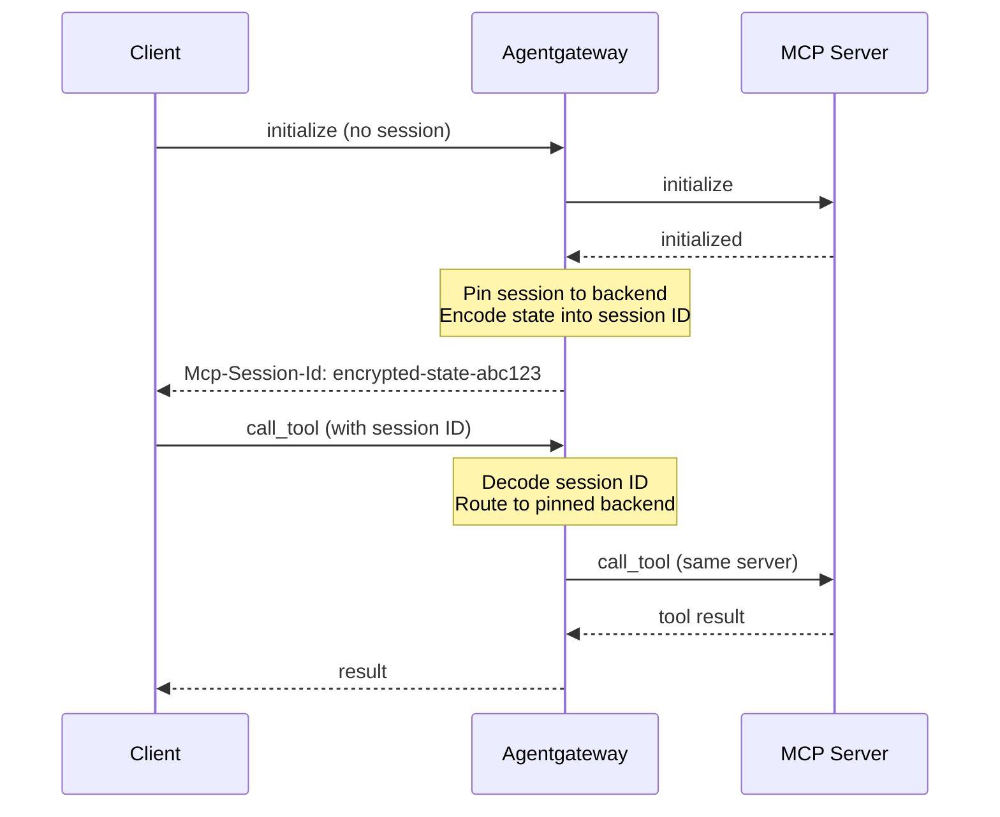

Connect to an MCP server via streamable HTTP. 



## About streamable HTTP

Agentgateway automatically manages stateful MCP sessions when using HTTP-based transports. The session state (including backend pinning) is encoded in the session ID and persisted across requests, ensuring that subsequent tool calls in the same session are routed to the same backend server.



1. **Session initialization**: When a client sends an `initialize` request, agentgateway creates a session and returns a session ID
2. **Backend pinning**: The session is pinned to a specific backend server (important when using multiple targets)
3. **State encoding**: The session state is encoded into the session ID using AES-256-GCM encryption
4. **Session resumption**: Subsequent requests with the same session ID are automatically routed to the same backend

## Stateless sessions {#stateless-sessions}

By default, agentgateway proxies streamable HTTP in **stateful** mode, as described in the previous section. You can instead run in **stateless** mode with the `statefulMode` field, so that agentgateway does not create a session or return an `Mcp-Session-Id` header. Each request is treated independently, and the client must send the full context that the request needs. This mode suits stateless agents, or MCP servers where the client handles state directly.

> [!NOTE]
> The `statefulMode` field controls how agentgateway proxies session-based servers. It is separate from the newer, inherently sessionless `2026-07-28` MCP protocol, which agentgateway supports automatically through version negotiation. For more information, see [MCP spec compatibility]().

To use stateless mode, set `statefulMode` to `stateless` on the MCP configuration.

```yaml
# yaml-language-server: $schema=https://agentgateway.dev/schema/config
mcp:
  port: 3000
  statefulMode: stateless
  targets:
  - name: mcp
    mcp:
      host: http://localhost:3005/mcp/
```

When you send an `initialize` request through agentgateway in stateless mode, the response returns `HTTP 200` with no `Mcp-Session-Id` header. In the default stateful mode, the same request returns an `Mcp-Session-Id` header that pins the session to a backend.


# WHAT THIS TEST VALIDATES:
#   * statefulMode: stateless is accepted and the MCP endpoint serves an initialize request (HTTP 200)
#   * In stateless mode, the initialize response does NOT include an Mcp-Session-Id header
# WHAT THIS TEST DOES NOT VALIDATE (and why):
#   * The visible example uses a streamable HTTP upstream (host: http://localhost:3005/mcp/);
#     the hidden test config uses a self-contained stdio target so no external MCP server is
#     needed. statefulMode governs the downstream (client-facing) session, independent of the
#     upstream transport, so the stateless behavior under test is the same.
#   * The default stateful contrast (Mcp-Session-Id present) is covered by other pages that
#     use the default configuration.



# Install agentgateway binary




cat <<'EOF' > config.yaml
# yaml-language-server: $schema=https://agentgateway.dev/schema/config
mcp:
  port: 3000
  statefulMode: stateless
  targets:
  - name: everything
    stdio:
      cmd: npx
      args: ["@modelcontextprotocol/server-everything"]
EOF



agentgateway -f config.yaml &
AGW_PID=$!
trap 'kill $AGW_PID 2>/dev/null' EXIT
sleep 3



YAMLTest -f - <<'EOF'
- name: MCP endpoint accepts initialize request in stateless mode
  http:
    url: "http://localhost:3000"
    path: /mcp
    method: POST
    headers:
      content-type: application/json
      accept: "application/json, text/event-stream"
    body: |
      {"jsonrpc":"2.0","method":"initialize","params":{"protocolVersion":"2024-11-05","capabilities":{},"clientInfo":{"name":"test","version":"1.0"}},"id":1}
  source:
    type: local
  expect:
    statusCode: 200
EOF



# Assert that stateless mode does not return an Mcp-Session-Id header
if curl -sS -D - -o /dev/null -X POST http://localhost:3000/mcp/ \
  -H 'Content-Type: application/json' \
  -H 'Accept: application/json, text/event-stream' \
  -d '{"jsonrpc":"2.0","method":"initialize","params":{"protocolVersion":"2024-11-05","capabilities":{},"clientInfo":{"name":"test","version":"1.0"}},"id":1}' \
  | grep -qi 'mcp-session-id'; then
  echo "FAIL: stateless mode returned an Mcp-Session-Id header"
  exit 1
fi
echo "PASS: no Mcp-Session-Id header in stateless mode"


## Request body limits {#mcp-request-body-limits}

The MCP listener applies the gateway HTTP body buffer limit to JSON-RPC request bodies from streamable HTTP and legacy Server-Sent Events (SSE) POST requests. If a request body exceeds the configured limit, the client receives HTTP 413 and a response body that includes the configured byte limit. Malformed JSON that stays within the limit receives HTTP 400.

## DNS rebinding protection {#dns-rebinding}

A browser page on any origin can resolve a hostname it controls to `127.0.0.1` and then send requests to a locally bound server. This is a DNS rebinding attack, and it is why the MCP specification requires a server that listens on localhost to reject a `Host` or `Origin` header that does not name a loopback address.

Agentgateway is usually a proxy in front of other servers rather than a browser-facing localhost server, so this check is off by default. Turn it on with `dnsRebindingProtection` when you run agentgateway on a developer machine and a browser can reach the MCP port.

```yaml
# yaml-language-server: $schema=https://agentgateway.dev/schema/config
mcp:
  port: 3000
  dnsRebindingProtection: true
  targets:
  - name: mcp
    mcp:
      host: http://localhost:3005/mcp/
```

When the check is on, agentgateway applies the following rules.

| Rule | Behavior |
| -- | -- |
| Host must be loopback | The request authority must be `localhost`, `127.0.0.1`, or `[::1]`. A port is allowed. |
| Origin must be loopback | If the request carries an `Origin` header, it must name one of the same three hosts. |
| A missing Origin is allowed | A non-browser client and a same-origin request often omit the header, so agentgateway accepts a request that has no `Origin`. |
| A duplicate Origin is rejected | `Origin` is a singleton header. Agentgateway rejects a request that carries more than one, rather than validating only the first. |

A request that fails any rule receives a `403` response with the body `MCP DNS rebinding protection: Host/Origin must be localhost, 127.0.0.1, or [::1]`.

> [!WARNING]
> Do not turn this on for an agentgateway that serves MCP to clients over the network. Every request from a remote client names a non-loopback host, so agentgateway rejects all of them.

## Before you begin



## Configure the agentgateway

1. Spin up an MCP server that uses streamable HTTP.
   ```sh
   PORT=3005 npx -y @modelcontextprotocol/server-everything streamableHttp
   ```

2. Create a configuration for your agentgateway to connect to your MCP server. Make sure to expose the `Mcp-Session-Id` header in the CORS configuration for session persistence.
   ```yaml
   cat <<EOF > config.yaml
   # yaml-language-server: $schema=https://agentgateway.dev/schema/config
   mcp:
     port: 3000
     policies:
       cors:
         allowOrigins:
           - "*"
         allowHeaders:
           - "*"
         exposeHeaders:
           - "Mcp-Session-Id"
     targets:
     - name: mcp
       mcp:
         host: http://localhost:3005/mcp/
   EOF
   ```

3. Run the agentgateway. 
   ```sh
   agentgateway -f config.yaml
   ```

## Verify access to tools

1. Open the [agentgateway UI](http://localhost:15000/ui/) to view your listener and backend configuration.

2. Connect to the MCP test server with the agentgateway UI playground.

   1. From the navigation menu under **MCP**, click **Tool Playground**.
   2. If you see a **Browser access is not allowed** notice, click **Apply CORS** so the playground can call the MCP listener from the UI.
   3. Click **Initialize** to open an MCP session. The agentgateway UI connects to the target that you configured and lists the tools that are exposed on the target.

      
      

3. Verify access to a tool.
   1. From the **Tool** list, select the `echo` tool.
   2. In the **Message** field, enter any string, such as `This is my first agentgateway setup.`, and click **Call tool**.
   3. Verify that the **Result** card shows an `HTTP 200` response with your message echoed back.

      
      
